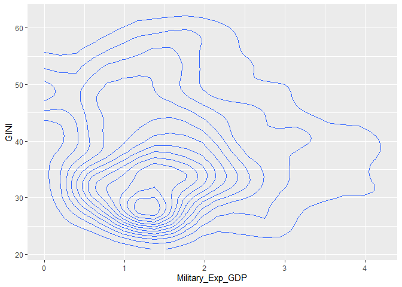
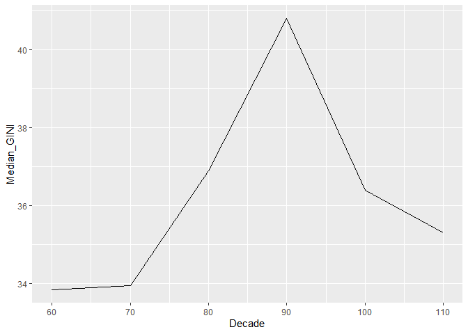
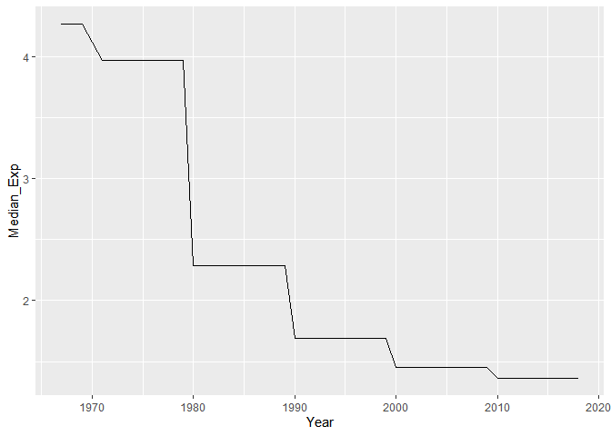

Exploring World Bank Data
================
Gustavo Arruda Franco

## Load necessary libraries

``` r
library(tidyverse)
```

    ## -- Attaching packages ---------------------------------------------------------- tidyverse 1.3.0 --

    ## v ggplot2 3.3.2     v purrr   0.3.4
    ## v tibble  3.0.3     v dplyr   1.0.2
    ## v tidyr   1.1.2     v stringr 1.4.0
    ## v readr   1.3.1     v forcats 0.5.0

    ## -- Conflicts ------------------------------------------------------------- tidyverse_conflicts() --
    ## x dplyr::filter() masks stats::filter()
    ## x dplyr::lag()    masks stats::lag()

## Write a function to import the data files

``` r
import_data <- function(a){
  read_csv(a, skip = 4) %>% #Skip first 4 misleading rows
  select(-c(X65, `Indicator Name`)) %>% #Drop unnecessary columns
  pivot_longer(cols = c(4:63), names_to = "Year", names_transform = list(Year = as.double), values_to = "Value") %>% #Transform column names referencing years into a single numerical variable
  pivot_wider(names_from = "Indicator Code", values_from = "Value") %>% #Transform rows of Indicators into columns
  select("Country Name", "Year", GINI = "SI.POV.GINI", Military_Exp_GDP = "MS.MIL.XPND.GD.ZS") %>% #Select relevant variables
  drop_na() #Drop rows with empty values
}
```

## Import the data

``` r
full_countries <- dir("data_world_bank", pattern = "\\.csv$", full.names = TRUE) #Save all file paths into a vector
wb_gini_military <- map_df(full_countries, import_data) #Iterate importing function through vector of file paths, creating an unified data frame
```

    ## Warning: Missing column names filled in: 'X65' [65]

    ## Parsed with column specification:
    ## cols(
    ##   .default = col_double(),
    ##   `Country Name` = col_character(),
    ##   `Country Code` = col_character(),
    ##   `Indicator Name` = col_character(),
    ##   `Indicator Code` = col_character(),
    ##   X65 = col_logical()
    ## )

    ## See spec(...) for full column specifications.

    ## Warning: Missing column names filled in: 'X65' [65]

    ## Parsed with column specification:
    ## cols(
    ##   .default = col_double(),
    ##   `Country Name` = col_character(),
    ##   `Country Code` = col_character(),
    ##   `Indicator Name` = col_character(),
    ##   `Indicator Code` = col_character(),
    ##   X65 = col_logical()
    ## )
    ## See spec(...) for full column specifications.

    ## Warning: Missing column names filled in: 'X65' [65]

    ## Parsed with column specification:
    ## cols(
    ##   .default = col_double(),
    ##   `Country Name` = col_character(),
    ##   `Country Code` = col_character(),
    ##   `Indicator Name` = col_character(),
    ##   `Indicator Code` = col_character(),
    ##   X65 = col_logical()
    ## )
    ## See spec(...) for full column specifications.

    ## Warning: Missing column names filled in: 'X65' [65]

    ## Parsed with column specification:
    ## cols(
    ##   .default = col_double(),
    ##   `Country Name` = col_character(),
    ##   `Country Code` = col_character(),
    ##   `Indicator Name` = col_character(),
    ##   `Indicator Code` = col_character(),
    ##   X65 = col_logical()
    ## )
    ## See spec(...) for full column specifications.

    ## Warning: Missing column names filled in: 'X65' [65]

    ## Parsed with column specification:
    ## cols(
    ##   .default = col_double(),
    ##   `Country Name` = col_character(),
    ##   `Country Code` = col_character(),
    ##   `Indicator Name` = col_character(),
    ##   `Indicator Code` = col_character(),
    ##   X65 = col_logical()
    ## )
    ## See spec(...) for full column specifications.

    ## Warning: Missing column names filled in: 'X65' [65]

    ## Parsed with column specification:
    ## cols(
    ##   .default = col_double(),
    ##   `Country Name` = col_character(),
    ##   `Country Code` = col_character(),
    ##   `Indicator Name` = col_character(),
    ##   `Indicator Code` = col_character(),
    ##   X65 = col_logical()
    ## )
    ## See spec(...) for full column specifications.

    ## Warning: Missing column names filled in: 'X65' [65]

    ## Parsed with column specification:
    ## cols(
    ##   .default = col_double(),
    ##   `Country Name` = col_character(),
    ##   `Country Code` = col_character(),
    ##   `Indicator Name` = col_character(),
    ##   `Indicator Code` = col_character(),
    ##   X65 = col_logical()
    ## )
    ## See spec(...) for full column specifications.

    ## Warning: Missing column names filled in: 'X65' [65]

    ## Parsed with column specification:
    ## cols(
    ##   .default = col_double(),
    ##   `Country Name` = col_character(),
    ##   `Country Code` = col_character(),
    ##   `Indicator Name` = col_character(),
    ##   `Indicator Code` = col_character(),
    ##   X65 = col_logical()
    ## )
    ## See spec(...) for full column specifications.

    ## Warning: Missing column names filled in: 'X65' [65]

    ## Parsed with column specification:
    ## cols(
    ##   .default = col_double(),
    ##   `Country Name` = col_character(),
    ##   `Country Code` = col_character(),
    ##   `Indicator Name` = col_character(),
    ##   `Indicator Code` = col_character(),
    ##   X65 = col_logical()
    ## )
    ## See spec(...) for full column specifications.

    ## Warning: Missing column names filled in: 'X65' [65]

    ## Parsed with column specification:
    ## cols(
    ##   .default = col_double(),
    ##   `Country Name` = col_character(),
    ##   `Country Code` = col_character(),
    ##   `Indicator Name` = col_character(),
    ##   `Indicator Code` = col_character(),
    ##   X65 = col_logical()
    ## )
    ## See spec(...) for full column specifications.

    ## Warning: Missing column names filled in: 'X65' [65]

    ## Parsed with column specification:
    ## cols(
    ##   .default = col_double(),
    ##   `Country Name` = col_character(),
    ##   `Country Code` = col_character(),
    ##   `Indicator Name` = col_character(),
    ##   `Indicator Code` = col_character(),
    ##   X65 = col_logical()
    ## )
    ## See spec(...) for full column specifications.

    ## Warning: Missing column names filled in: 'X65' [65]

    ## Parsed with column specification:
    ## cols(
    ##   .default = col_double(),
    ##   `Country Name` = col_character(),
    ##   `Country Code` = col_character(),
    ##   `Indicator Name` = col_character(),
    ##   `Indicator Code` = col_character(),
    ##   X65 = col_logical()
    ## )
    ## See spec(...) for full column specifications.

    ## Warning: Missing column names filled in: 'X65' [65]

    ## Parsed with column specification:
    ## cols(
    ##   .default = col_double(),
    ##   `Country Name` = col_character(),
    ##   `Country Code` = col_character(),
    ##   `Indicator Name` = col_character(),
    ##   `Indicator Code` = col_character(),
    ##   X65 = col_logical()
    ## )
    ## See spec(...) for full column specifications.

    ## Warning: Missing column names filled in: 'X65' [65]

    ## Parsed with column specification:
    ## cols(
    ##   .default = col_double(),
    ##   `Country Name` = col_character(),
    ##   `Country Code` = col_character(),
    ##   `Indicator Name` = col_character(),
    ##   `Indicator Code` = col_character(),
    ##   X65 = col_logical()
    ## )
    ## See spec(...) for full column specifications.

    ## Warning: Missing column names filled in: 'X65' [65]

    ## Parsed with column specification:
    ## cols(
    ##   .default = col_double(),
    ##   `Country Name` = col_character(),
    ##   `Country Code` = col_character(),
    ##   `Indicator Name` = col_character(),
    ##   `Indicator Code` = col_character(),
    ##   X65 = col_logical()
    ## )
    ## See spec(...) for full column specifications.

    ## Warning: Missing column names filled in: 'X65' [65]

    ## Parsed with column specification:
    ## cols(
    ##   .default = col_double(),
    ##   `Country Name` = col_character(),
    ##   `Country Code` = col_character(),
    ##   `Indicator Name` = col_character(),
    ##   `Indicator Code` = col_character(),
    ##   X65 = col_logical()
    ## )
    ## See spec(...) for full column specifications.

    ## Warning: Missing column names filled in: 'X65' [65]

    ## Parsed with column specification:
    ## cols(
    ##   .default = col_double(),
    ##   `Country Name` = col_character(),
    ##   `Country Code` = col_character(),
    ##   `Indicator Name` = col_character(),
    ##   `Indicator Code` = col_character(),
    ##   X65 = col_logical()
    ## )
    ## See spec(...) for full column specifications.

    ## Warning: Missing column names filled in: 'X65' [65]

    ## Parsed with column specification:
    ## cols(
    ##   .default = col_double(),
    ##   `Country Name` = col_character(),
    ##   `Country Code` = col_character(),
    ##   `Indicator Name` = col_character(),
    ##   `Indicator Code` = col_character(),
    ##   X65 = col_logical()
    ## )
    ## See spec(...) for full column specifications.

    ## Warning: Missing column names filled in: 'X65' [65]

    ## Parsed with column specification:
    ## cols(
    ##   .default = col_double(),
    ##   `Country Name` = col_character(),
    ##   `Country Code` = col_character(),
    ##   `Indicator Name` = col_character(),
    ##   `Indicator Code` = col_character(),
    ##   X65 = col_logical()
    ## )
    ## See spec(...) for full column specifications.

    ## Warning: Missing column names filled in: 'X65' [65]

    ## Parsed with column specification:
    ## cols(
    ##   .default = col_double(),
    ##   `Country Name` = col_character(),
    ##   `Country Code` = col_character(),
    ##   `Indicator Name` = col_character(),
    ##   `Indicator Code` = col_character(),
    ##   X65 = col_logical()
    ## )
    ## See spec(...) for full column specifications.

    ## Warning: Missing column names filled in: 'X65' [65]

    ## Parsed with column specification:
    ## cols(
    ##   .default = col_double(),
    ##   `Country Name` = col_character(),
    ##   `Country Code` = col_character(),
    ##   `Indicator Name` = col_character(),
    ##   `Indicator Code` = col_character(),
    ##   X65 = col_logical()
    ## )
    ## See spec(...) for full column specifications.

    ## Warning: Missing column names filled in: 'X65' [65]

    ## Parsed with column specification:
    ## cols(
    ##   .default = col_double(),
    ##   `Country Name` = col_character(),
    ##   `Country Code` = col_character(),
    ##   `Indicator Name` = col_character(),
    ##   `Indicator Code` = col_character(),
    ##   X65 = col_logical()
    ## )
    ## See spec(...) for full column specifications.

    ## Warning: Missing column names filled in: 'X65' [65]

    ## Parsed with column specification:
    ## cols(
    ##   .default = col_double(),
    ##   `Country Name` = col_character(),
    ##   `Country Code` = col_character(),
    ##   `Indicator Name` = col_character(),
    ##   `Indicator Code` = col_character(),
    ##   X65 = col_logical()
    ## )
    ## See spec(...) for full column specifications.

    ## Warning: Missing column names filled in: 'X65' [65]

    ## Parsed with column specification:
    ## cols(
    ##   .default = col_double(),
    ##   `Country Name` = col_character(),
    ##   `Country Code` = col_character(),
    ##   `Indicator Name` = col_character(),
    ##   `Indicator Code` = col_character(),
    ##   X65 = col_logical()
    ## )
    ## See spec(...) for full column specifications.

    ## Warning: Missing column names filled in: 'X65' [65]

    ## Parsed with column specification:
    ## cols(
    ##   .default = col_double(),
    ##   `Country Name` = col_character(),
    ##   `Country Code` = col_character(),
    ##   `Indicator Name` = col_character(),
    ##   `Indicator Code` = col_character(),
    ##   X65 = col_logical()
    ## )
    ## See spec(...) for full column specifications.

    ## Warning: Missing column names filled in: 'X65' [65]

    ## Parsed with column specification:
    ## cols(
    ##   .default = col_double(),
    ##   `Country Name` = col_character(),
    ##   `Country Code` = col_character(),
    ##   `Indicator Name` = col_character(),
    ##   `Indicator Code` = col_character(),
    ##   X65 = col_logical()
    ## )
    ## See spec(...) for full column specifications.

    ## Warning: Missing column names filled in: 'X65' [65]

    ## Parsed with column specification:
    ## cols(
    ##   .default = col_double(),
    ##   `Country Name` = col_character(),
    ##   `Country Code` = col_character(),
    ##   `Indicator Name` = col_character(),
    ##   `Indicator Code` = col_character(),
    ##   X65 = col_logical()
    ## )
    ## See spec(...) for full column specifications.

    ## Warning: Missing column names filled in: 'X65' [65]

    ## Parsed with column specification:
    ## cols(
    ##   .default = col_double(),
    ##   `Country Name` = col_character(),
    ##   `Country Code` = col_character(),
    ##   `Indicator Name` = col_character(),
    ##   `Indicator Code` = col_character(),
    ##   X65 = col_logical()
    ## )
    ## See spec(...) for full column specifications.

    ## Warning: Missing column names filled in: 'X65' [65]

    ## Parsed with column specification:
    ## cols(
    ##   .default = col_double(),
    ##   `Country Name` = col_character(),
    ##   `Country Code` = col_character(),
    ##   `Indicator Name` = col_character(),
    ##   `Indicator Code` = col_character(),
    ##   X65 = col_logical()
    ## )
    ## See spec(...) for full column specifications.

    ## Warning: Missing column names filled in: 'X65' [65]

    ## Parsed with column specification:
    ## cols(
    ##   .default = col_double(),
    ##   `Country Name` = col_character(),
    ##   `Country Code` = col_character(),
    ##   `Indicator Name` = col_character(),
    ##   `Indicator Code` = col_character(),
    ##   X65 = col_logical()
    ## )
    ## See spec(...) for full column specifications.

    ## Warning: Missing column names filled in: 'X65' [65]

    ## Parsed with column specification:
    ## cols(
    ##   .default = col_double(),
    ##   `Country Name` = col_character(),
    ##   `Country Code` = col_character(),
    ##   `Indicator Name` = col_character(),
    ##   `Indicator Code` = col_character(),
    ##   X65 = col_logical()
    ## )
    ## See spec(...) for full column specifications.

    ## Warning: Missing column names filled in: 'X65' [65]

    ## Parsed with column specification:
    ## cols(
    ##   .default = col_double(),
    ##   `Country Name` = col_character(),
    ##   `Country Code` = col_character(),
    ##   `Indicator Name` = col_character(),
    ##   `Indicator Code` = col_character(),
    ##   X65 = col_logical()
    ## )
    ## See spec(...) for full column specifications.

    ## Warning: Missing column names filled in: 'X65' [65]

    ## Parsed with column specification:
    ## cols(
    ##   .default = col_double(),
    ##   `Country Name` = col_character(),
    ##   `Country Code` = col_character(),
    ##   `Indicator Name` = col_character(),
    ##   `Indicator Code` = col_character(),
    ##   X65 = col_logical()
    ## )
    ## See spec(...) for full column specifications.

    ## Warning: Missing column names filled in: 'X65' [65]

    ## Parsed with column specification:
    ## cols(
    ##   .default = col_double(),
    ##   `Country Name` = col_character(),
    ##   `Country Code` = col_character(),
    ##   `Indicator Name` = col_character(),
    ##   `Indicator Code` = col_character(),
    ##   X65 = col_logical()
    ## )
    ## See spec(...) for full column specifications.

    ## Warning: Missing column names filled in: 'X65' [65]

    ## Parsed with column specification:
    ## cols(
    ##   .default = col_double(),
    ##   `Country Name` = col_character(),
    ##   `Country Code` = col_character(),
    ##   `Indicator Name` = col_character(),
    ##   `Indicator Code` = col_character(),
    ##   X65 = col_logical()
    ## )
    ## See spec(...) for full column specifications.

    ## Warning: Missing column names filled in: 'X65' [65]

    ## Parsed with column specification:
    ## cols(
    ##   .default = col_double(),
    ##   `Country Name` = col_character(),
    ##   `Country Code` = col_character(),
    ##   `Indicator Name` = col_character(),
    ##   `Indicator Code` = col_character(),
    ##   X65 = col_logical()
    ## )
    ## See spec(...) for full column specifications.

    ## Warning: Missing column names filled in: 'X65' [65]

    ## Parsed with column specification:
    ## cols(
    ##   .default = col_double(),
    ##   `Country Name` = col_character(),
    ##   `Country Code` = col_character(),
    ##   `Indicator Name` = col_character(),
    ##   `Indicator Code` = col_character(),
    ##   X65 = col_logical()
    ## )
    ## See spec(...) for full column specifications.

    ## Warning: Missing column names filled in: 'X65' [65]

    ## Parsed with column specification:
    ## cols(
    ##   .default = col_double(),
    ##   `Country Name` = col_character(),
    ##   `Country Code` = col_character(),
    ##   `Indicator Name` = col_character(),
    ##   `Indicator Code` = col_character(),
    ##   X65 = col_logical()
    ## )
    ## See spec(...) for full column specifications.

    ## Warning: Missing column names filled in: 'X65' [65]

    ## Parsed with column specification:
    ## cols(
    ##   .default = col_double(),
    ##   `Country Name` = col_character(),
    ##   `Country Code` = col_character(),
    ##   `Indicator Name` = col_character(),
    ##   `Indicator Code` = col_character(),
    ##   X65 = col_logical()
    ## )
    ## See spec(...) for full column specifications.

    ## Warning: Missing column names filled in: 'X65' [65]

    ## Parsed with column specification:
    ## cols(
    ##   .default = col_double(),
    ##   `Country Name` = col_character(),
    ##   `Country Code` = col_character(),
    ##   `Indicator Name` = col_character(),
    ##   `Indicator Code` = col_character(),
    ##   X65 = col_logical()
    ## )
    ## See spec(...) for full column specifications.

    ## Warning: Missing column names filled in: 'X65' [65]

    ## Parsed with column specification:
    ## cols(
    ##   .default = col_double(),
    ##   `Country Name` = col_character(),
    ##   `Country Code` = col_character(),
    ##   `Indicator Name` = col_character(),
    ##   `Indicator Code` = col_character(),
    ##   X65 = col_logical()
    ## )
    ## See spec(...) for full column specifications.

    ## Warning: Missing column names filled in: 'X65' [65]

    ## Parsed with column specification:
    ## cols(
    ##   .default = col_double(),
    ##   `Country Name` = col_character(),
    ##   `Country Code` = col_character(),
    ##   `Indicator Name` = col_character(),
    ##   `Indicator Code` = col_character(),
    ##   X65 = col_logical()
    ## )
    ## See spec(...) for full column specifications.

    ## Warning: Missing column names filled in: 'X65' [65]

    ## Parsed with column specification:
    ## cols(
    ##   .default = col_double(),
    ##   `Country Name` = col_character(),
    ##   `Country Code` = col_character(),
    ##   `Indicator Name` = col_character(),
    ##   `Indicator Code` = col_character(),
    ##   X65 = col_logical()
    ## )
    ## See spec(...) for full column specifications.

    ## Warning: Missing column names filled in: 'X65' [65]

    ## Parsed with column specification:
    ## cols(
    ##   .default = col_double(),
    ##   `Country Name` = col_character(),
    ##   `Country Code` = col_character(),
    ##   `Indicator Name` = col_character(),
    ##   `Indicator Code` = col_character(),
    ##   X65 = col_logical()
    ## )
    ## See spec(...) for full column specifications.

    ## Warning: Missing column names filled in: 'X65' [65]

    ## Parsed with column specification:
    ## cols(
    ##   .default = col_double(),
    ##   `Country Name` = col_character(),
    ##   `Country Code` = col_character(),
    ##   `Indicator Name` = col_character(),
    ##   `Indicator Code` = col_character(),
    ##   X65 = col_logical()
    ## )
    ## See spec(...) for full column specifications.

    ## Warning: Missing column names filled in: 'X65' [65]

    ## Parsed with column specification:
    ## cols(
    ##   .default = col_double(),
    ##   `Country Name` = col_character(),
    ##   `Country Code` = col_character(),
    ##   `Indicator Name` = col_character(),
    ##   `Indicator Code` = col_character(),
    ##   X65 = col_logical()
    ## )
    ## See spec(...) for full column specifications.

    ## Warning: Missing column names filled in: 'X65' [65]

    ## Parsed with column specification:
    ## cols(
    ##   .default = col_double(),
    ##   `Country Name` = col_character(),
    ##   `Country Code` = col_character(),
    ##   `Indicator Name` = col_character(),
    ##   `Indicator Code` = col_character(),
    ##   X65 = col_logical()
    ## )
    ## See spec(...) for full column specifications.

    ## Warning: Missing column names filled in: 'X65' [65]

    ## Parsed with column specification:
    ## cols(
    ##   .default = col_double(),
    ##   `Country Name` = col_character(),
    ##   `Country Code` = col_character(),
    ##   `Indicator Name` = col_character(),
    ##   `Indicator Code` = col_character(),
    ##   X65 = col_logical()
    ## )
    ## See spec(...) for full column specifications.

    ## Warning: Missing column names filled in: 'X65' [65]

    ## Parsed with column specification:
    ## cols(
    ##   .default = col_double(),
    ##   `Country Name` = col_character(),
    ##   `Country Code` = col_character(),
    ##   `Indicator Name` = col_character(),
    ##   `Indicator Code` = col_character(),
    ##   X65 = col_logical()
    ## )
    ## See spec(...) for full column specifications.

    ## Warning: Missing column names filled in: 'X65' [65]

    ## Parsed with column specification:
    ## cols(
    ##   .default = col_double(),
    ##   `Country Name` = col_character(),
    ##   `Country Code` = col_character(),
    ##   `Indicator Name` = col_character(),
    ##   `Indicator Code` = col_character(),
    ##   X65 = col_logical()
    ## )
    ## See spec(...) for full column specifications.

    ## Warning: Missing column names filled in: 'X65' [65]

    ## Parsed with column specification:
    ## cols(
    ##   .default = col_double(),
    ##   `Country Name` = col_character(),
    ##   `Country Code` = col_character(),
    ##   `Indicator Name` = col_character(),
    ##   `Indicator Code` = col_character(),
    ##   X65 = col_logical()
    ## )
    ## See spec(...) for full column specifications.

    ## Warning: Missing column names filled in: 'X65' [65]

    ## Parsed with column specification:
    ## cols(
    ##   .default = col_double(),
    ##   `Country Name` = col_character(),
    ##   `Country Code` = col_character(),
    ##   `Indicator Name` = col_character(),
    ##   `Indicator Code` = col_character(),
    ##   X65 = col_logical()
    ## )
    ## See spec(...) for full column specifications.

    ## Warning: Missing column names filled in: 'X65' [65]

    ## Parsed with column specification:
    ## cols(
    ##   .default = col_double(),
    ##   `Country Name` = col_character(),
    ##   `Country Code` = col_character(),
    ##   `Indicator Name` = col_character(),
    ##   `Indicator Code` = col_character(),
    ##   X65 = col_logical()
    ## )
    ## See spec(...) for full column specifications.

    ## Warning: Missing column names filled in: 'X65' [65]

    ## Parsed with column specification:
    ## cols(
    ##   .default = col_double(),
    ##   `Country Name` = col_character(),
    ##   `Country Code` = col_character(),
    ##   `Indicator Name` = col_character(),
    ##   `Indicator Code` = col_character(),
    ##   X65 = col_logical()
    ## )
    ## See spec(...) for full column specifications.

    ## Warning: Missing column names filled in: 'X65' [65]

    ## Parsed with column specification:
    ## cols(
    ##   .default = col_double(),
    ##   `Country Name` = col_character(),
    ##   `Country Code` = col_character(),
    ##   `Indicator Name` = col_character(),
    ##   `Indicator Code` = col_character(),
    ##   X65 = col_logical()
    ## )
    ## See spec(...) for full column specifications.

    ## Warning: Missing column names filled in: 'X65' [65]

    ## Parsed with column specification:
    ## cols(
    ##   .default = col_double(),
    ##   `Country Name` = col_character(),
    ##   `Country Code` = col_character(),
    ##   `Indicator Name` = col_character(),
    ##   `Indicator Code` = col_character(),
    ##   X65 = col_logical()
    ## )
    ## See spec(...) for full column specifications.

    ## Warning: Missing column names filled in: 'X65' [65]

    ## Parsed with column specification:
    ## cols(
    ##   .default = col_double(),
    ##   `Country Name` = col_character(),
    ##   `Country Code` = col_character(),
    ##   `Indicator Name` = col_character(),
    ##   `Indicator Code` = col_character(),
    ##   X65 = col_logical()
    ## )
    ## See spec(...) for full column specifications.

    ## Warning: Missing column names filled in: 'X65' [65]

    ## Parsed with column specification:
    ## cols(
    ##   .default = col_double(),
    ##   `Country Name` = col_character(),
    ##   `Country Code` = col_character(),
    ##   `Indicator Name` = col_character(),
    ##   `Indicator Code` = col_character(),
    ##   X65 = col_logical()
    ## )
    ## See spec(...) for full column specifications.

    ## Warning: Missing column names filled in: 'X65' [65]

    ## Parsed with column specification:
    ## cols(
    ##   .default = col_double(),
    ##   `Country Name` = col_character(),
    ##   `Country Code` = col_character(),
    ##   `Indicator Name` = col_character(),
    ##   `Indicator Code` = col_character(),
    ##   X65 = col_logical()
    ## )
    ## See spec(...) for full column specifications.

    ## Warning: Missing column names filled in: 'X65' [65]

    ## Parsed with column specification:
    ## cols(
    ##   .default = col_double(),
    ##   `Country Name` = col_character(),
    ##   `Country Code` = col_character(),
    ##   `Indicator Name` = col_character(),
    ##   `Indicator Code` = col_character(),
    ##   X65 = col_logical()
    ## )
    ## See spec(...) for full column specifications.

    ## Warning: Missing column names filled in: 'X65' [65]

    ## Parsed with column specification:
    ## cols(
    ##   .default = col_double(),
    ##   `Country Name` = col_character(),
    ##   `Country Code` = col_character(),
    ##   `Indicator Name` = col_character(),
    ##   `Indicator Code` = col_character(),
    ##   X65 = col_logical()
    ## )
    ## See spec(...) for full column specifications.

    ## Warning: Missing column names filled in: 'X65' [65]

    ## Parsed with column specification:
    ## cols(
    ##   .default = col_double(),
    ##   `Country Name` = col_character(),
    ##   `Country Code` = col_character(),
    ##   `Indicator Name` = col_character(),
    ##   `Indicator Code` = col_character(),
    ##   X65 = col_logical()
    ## )
    ## See spec(...) for full column specifications.

    ## Warning: Missing column names filled in: 'X65' [65]

    ## Parsed with column specification:
    ## cols(
    ##   .default = col_double(),
    ##   `Country Name` = col_character(),
    ##   `Country Code` = col_character(),
    ##   `Indicator Name` = col_character(),
    ##   `Indicator Code` = col_character(),
    ##   X65 = col_logical()
    ## )
    ## See spec(...) for full column specifications.

    ## Warning: Missing column names filled in: 'X65' [65]

    ## Parsed with column specification:
    ## cols(
    ##   .default = col_double(),
    ##   `Country Name` = col_character(),
    ##   `Country Code` = col_character(),
    ##   `Indicator Name` = col_character(),
    ##   `Indicator Code` = col_character(),
    ##   X65 = col_logical()
    ## )
    ## See spec(...) for full column specifications.

    ## Warning: Missing column names filled in: 'X65' [65]

    ## Parsed with column specification:
    ## cols(
    ##   .default = col_double(),
    ##   `Country Name` = col_character(),
    ##   `Country Code` = col_character(),
    ##   `Indicator Name` = col_character(),
    ##   `Indicator Code` = col_character(),
    ##   X65 = col_logical()
    ## )
    ## See spec(...) for full column specifications.

    ## Warning: Missing column names filled in: 'X65' [65]

    ## Parsed with column specification:
    ## cols(
    ##   .default = col_double(),
    ##   `Country Name` = col_character(),
    ##   `Country Code` = col_character(),
    ##   `Indicator Name` = col_character(),
    ##   `Indicator Code` = col_character(),
    ##   X65 = col_logical()
    ## )
    ## See spec(...) for full column specifications.

    ## Warning: Missing column names filled in: 'X65' [65]

    ## Parsed with column specification:
    ## cols(
    ##   .default = col_double(),
    ##   `Country Name` = col_character(),
    ##   `Country Code` = col_character(),
    ##   `Indicator Name` = col_character(),
    ##   `Indicator Code` = col_character(),
    ##   X65 = col_logical()
    ## )
    ## See spec(...) for full column specifications.

    ## Warning: Missing column names filled in: 'X65' [65]

    ## Parsed with column specification:
    ## cols(
    ##   .default = col_double(),
    ##   `Country Name` = col_character(),
    ##   `Country Code` = col_character(),
    ##   `Indicator Name` = col_character(),
    ##   `Indicator Code` = col_character(),
    ##   X65 = col_logical()
    ## )
    ## See spec(...) for full column specifications.

    ## Warning: Missing column names filled in: 'X65' [65]

    ## Parsed with column specification:
    ## cols(
    ##   .default = col_double(),
    ##   `Country Name` = col_character(),
    ##   `Country Code` = col_character(),
    ##   `Indicator Name` = col_character(),
    ##   `Indicator Code` = col_character(),
    ##   X65 = col_logical()
    ## )
    ## See spec(...) for full column specifications.

    ## Warning: Missing column names filled in: 'X65' [65]

    ## Parsed with column specification:
    ## cols(
    ##   .default = col_double(),
    ##   `Country Name` = col_character(),
    ##   `Country Code` = col_character(),
    ##   `Indicator Name` = col_character(),
    ##   `Indicator Code` = col_character(),
    ##   X65 = col_logical()
    ## )
    ## See spec(...) for full column specifications.

    ## Warning: Missing column names filled in: 'X65' [65]

    ## Parsed with column specification:
    ## cols(
    ##   .default = col_double(),
    ##   `Country Name` = col_character(),
    ##   `Country Code` = col_character(),
    ##   `Indicator Name` = col_character(),
    ##   `Indicator Code` = col_character(),
    ##   X65 = col_logical()
    ## )
    ## See spec(...) for full column specifications.

    ## Warning: Missing column names filled in: 'X65' [65]

    ## Parsed with column specification:
    ## cols(
    ##   .default = col_double(),
    ##   `Country Name` = col_character(),
    ##   `Country Code` = col_character(),
    ##   `Indicator Name` = col_character(),
    ##   `Indicator Code` = col_character(),
    ##   X65 = col_logical()
    ## )
    ## See spec(...) for full column specifications.

    ## Warning: Missing column names filled in: 'X65' [65]

    ## Parsed with column specification:
    ## cols(
    ##   .default = col_double(),
    ##   `Country Name` = col_character(),
    ##   `Country Code` = col_character(),
    ##   `Indicator Name` = col_character(),
    ##   `Indicator Code` = col_character(),
    ##   X65 = col_logical()
    ## )
    ## See spec(...) for full column specifications.

    ## Warning: Missing column names filled in: 'X65' [65]

    ## Parsed with column specification:
    ## cols(
    ##   .default = col_double(),
    ##   `Country Name` = col_character(),
    ##   `Country Code` = col_character(),
    ##   `Indicator Name` = col_character(),
    ##   `Indicator Code` = col_character(),
    ##   X65 = col_logical()
    ## )
    ## See spec(...) for full column specifications.

    ## Warning: Missing column names filled in: 'X65' [65]

    ## Parsed with column specification:
    ## cols(
    ##   .default = col_double(),
    ##   `Country Name` = col_character(),
    ##   `Country Code` = col_character(),
    ##   `Indicator Name` = col_character(),
    ##   `Indicator Code` = col_character(),
    ##   X65 = col_logical()
    ## )
    ## See spec(...) for full column specifications.

    ## Warning: Missing column names filled in: 'X65' [65]

    ## Parsed with column specification:
    ## cols(
    ##   .default = col_double(),
    ##   `Country Name` = col_character(),
    ##   `Country Code` = col_character(),
    ##   `Indicator Name` = col_character(),
    ##   `Indicator Code` = col_character(),
    ##   X65 = col_logical()
    ## )
    ## See spec(...) for full column specifications.

    ## Warning: Missing column names filled in: 'X65' [65]

    ## Parsed with column specification:
    ## cols(
    ##   .default = col_double(),
    ##   `Country Name` = col_character(),
    ##   `Country Code` = col_character(),
    ##   `Indicator Name` = col_character(),
    ##   `Indicator Code` = col_character(),
    ##   X65 = col_logical()
    ## )
    ## See spec(...) for full column specifications.

    ## Warning: Missing column names filled in: 'X65' [65]

    ## Parsed with column specification:
    ## cols(
    ##   .default = col_double(),
    ##   `Country Name` = col_character(),
    ##   `Country Code` = col_character(),
    ##   `Indicator Name` = col_character(),
    ##   `Indicator Code` = col_character(),
    ##   X65 = col_logical()
    ## )
    ## See spec(...) for full column specifications.

    ## Warning: Missing column names filled in: 'X65' [65]

    ## Parsed with column specification:
    ## cols(
    ##   .default = col_double(),
    ##   `Country Name` = col_character(),
    ##   `Country Code` = col_character(),
    ##   `Indicator Name` = col_character(),
    ##   `Indicator Code` = col_character(),
    ##   X65 = col_logical()
    ## )
    ## See spec(...) for full column specifications.

    ## Warning: Missing column names filled in: 'X65' [65]

    ## Parsed with column specification:
    ## cols(
    ##   .default = col_double(),
    ##   `Country Name` = col_character(),
    ##   `Country Code` = col_character(),
    ##   `Indicator Name` = col_character(),
    ##   `Indicator Code` = col_character(),
    ##   X65 = col_logical()
    ## )
    ## See spec(...) for full column specifications.

    ## Warning: Missing column names filled in: 'X65' [65]

    ## Parsed with column specification:
    ## cols(
    ##   .default = col_double(),
    ##   `Country Name` = col_character(),
    ##   `Country Code` = col_character(),
    ##   `Indicator Name` = col_character(),
    ##   `Indicator Code` = col_character(),
    ##   X65 = col_logical()
    ## )
    ## See spec(...) for full column specifications.

    ## Warning: Missing column names filled in: 'X65' [65]

    ## Parsed with column specification:
    ## cols(
    ##   .default = col_double(),
    ##   `Country Name` = col_character(),
    ##   `Country Code` = col_character(),
    ##   `Indicator Name` = col_character(),
    ##   `Indicator Code` = col_character(),
    ##   X65 = col_logical()
    ## )
    ## See spec(...) for full column specifications.

    ## Warning: Missing column names filled in: 'X65' [65]

    ## Parsed with column specification:
    ## cols(
    ##   .default = col_double(),
    ##   `Country Name` = col_character(),
    ##   `Country Code` = col_character(),
    ##   `Indicator Name` = col_character(),
    ##   `Indicator Code` = col_character(),
    ##   X65 = col_logical()
    ## )
    ## See spec(...) for full column specifications.

    ## Warning: Missing column names filled in: 'X65' [65]

    ## Parsed with column specification:
    ## cols(
    ##   .default = col_double(),
    ##   `Country Name` = col_character(),
    ##   `Country Code` = col_character(),
    ##   `Indicator Name` = col_character(),
    ##   `Indicator Code` = col_character(),
    ##   X65 = col_logical()
    ## )
    ## See spec(...) for full column specifications.

    ## Warning: Missing column names filled in: 'X65' [65]

    ## Parsed with column specification:
    ## cols(
    ##   .default = col_double(),
    ##   `Country Name` = col_character(),
    ##   `Country Code` = col_character(),
    ##   `Indicator Name` = col_character(),
    ##   `Indicator Code` = col_character(),
    ##   X65 = col_logical()
    ## )
    ## See spec(...) for full column specifications.

    ## Warning: Missing column names filled in: 'X65' [65]

    ## Parsed with column specification:
    ## cols(
    ##   .default = col_double(),
    ##   `Country Name` = col_character(),
    ##   `Country Code` = col_character(),
    ##   `Indicator Name` = col_character(),
    ##   `Indicator Code` = col_character(),
    ##   X65 = col_logical()
    ## )
    ## See spec(...) for full column specifications.

    ## Warning: Missing column names filled in: 'X65' [65]

    ## Parsed with column specification:
    ## cols(
    ##   .default = col_double(),
    ##   `Country Name` = col_character(),
    ##   `Country Code` = col_character(),
    ##   `Indicator Name` = col_character(),
    ##   `Indicator Code` = col_character(),
    ##   X65 = col_logical()
    ## )
    ## See spec(...) for full column specifications.

    ## Warning: Missing column names filled in: 'X65' [65]

    ## Parsed with column specification:
    ## cols(
    ##   .default = col_double(),
    ##   `Country Name` = col_character(),
    ##   `Country Code` = col_character(),
    ##   `Indicator Name` = col_character(),
    ##   `Indicator Code` = col_character(),
    ##   X65 = col_logical()
    ## )
    ## See spec(...) for full column specifications.

    ## Warning: Missing column names filled in: 'X65' [65]

    ## Parsed with column specification:
    ## cols(
    ##   .default = col_double(),
    ##   `Country Name` = col_character(),
    ##   `Country Code` = col_character(),
    ##   `Indicator Name` = col_character(),
    ##   `Indicator Code` = col_character(),
    ##   X65 = col_logical()
    ## )
    ## See spec(...) for full column specifications.

    ## Warning: Missing column names filled in: 'X65' [65]

    ## Parsed with column specification:
    ## cols(
    ##   .default = col_double(),
    ##   `Country Name` = col_character(),
    ##   `Country Code` = col_character(),
    ##   `Indicator Name` = col_character(),
    ##   `Indicator Code` = col_character(),
    ##   X65 = col_logical()
    ## )
    ## See spec(...) for full column specifications.

    ## Warning: Missing column names filled in: 'X65' [65]

    ## Parsed with column specification:
    ## cols(
    ##   .default = col_double(),
    ##   `Country Name` = col_character(),
    ##   `Country Code` = col_character(),
    ##   `Indicator Name` = col_character(),
    ##   `Indicator Code` = col_character(),
    ##   X65 = col_logical()
    ## )
    ## See spec(...) for full column specifications.

    ## Warning: Missing column names filled in: 'X65' [65]

    ## Parsed with column specification:
    ## cols(
    ##   .default = col_double(),
    ##   `Country Name` = col_character(),
    ##   `Country Code` = col_character(),
    ##   `Indicator Name` = col_character(),
    ##   `Indicator Code` = col_character(),
    ##   X65 = col_logical()
    ## )
    ## See spec(...) for full column specifications.

    ## Warning: Missing column names filled in: 'X65' [65]

    ## Parsed with column specification:
    ## cols(
    ##   .default = col_double(),
    ##   `Country Name` = col_character(),
    ##   `Country Code` = col_character(),
    ##   `Indicator Name` = col_character(),
    ##   `Indicator Code` = col_character(),
    ##   X65 = col_logical()
    ## )
    ## See spec(...) for full column specifications.

    ## Warning: Missing column names filled in: 'X65' [65]

    ## Parsed with column specification:
    ## cols(
    ##   .default = col_double(),
    ##   `Country Name` = col_character(),
    ##   `Country Code` = col_character(),
    ##   `Indicator Name` = col_character(),
    ##   `Indicator Code` = col_character(),
    ##   X65 = col_logical()
    ## )
    ## See spec(...) for full column specifications.

    ## Warning: Missing column names filled in: 'X65' [65]

    ## Parsed with column specification:
    ## cols(
    ##   .default = col_double(),
    ##   `Country Name` = col_character(),
    ##   `Country Code` = col_character(),
    ##   `Indicator Name` = col_character(),
    ##   `Indicator Code` = col_character(),
    ##   X65 = col_logical()
    ## )
    ## See spec(...) for full column specifications.

    ## Warning: Missing column names filled in: 'X65' [65]

    ## Parsed with column specification:
    ## cols(
    ##   .default = col_double(),
    ##   `Country Name` = col_character(),
    ##   `Country Code` = col_character(),
    ##   `Indicator Name` = col_character(),
    ##   `Indicator Code` = col_character(),
    ##   X65 = col_logical()
    ## )
    ## See spec(...) for full column specifications.

    ## Warning: Missing column names filled in: 'X65' [65]

    ## Parsed with column specification:
    ## cols(
    ##   .default = col_double(),
    ##   `Country Name` = col_character(),
    ##   `Country Code` = col_character(),
    ##   `Indicator Name` = col_character(),
    ##   `Indicator Code` = col_character(),
    ##   X65 = col_logical()
    ## )
    ## See spec(...) for full column specifications.

    ## Warning: Missing column names filled in: 'X65' [65]

    ## Parsed with column specification:
    ## cols(
    ##   .default = col_double(),
    ##   `Country Name` = col_character(),
    ##   `Country Code` = col_character(),
    ##   `Indicator Name` = col_character(),
    ##   `Indicator Code` = col_character(),
    ##   X65 = col_logical()
    ## )
    ## See spec(...) for full column specifications.

    ## Warning: Missing column names filled in: 'X65' [65]

    ## Parsed with column specification:
    ## cols(
    ##   .default = col_double(),
    ##   `Country Name` = col_character(),
    ##   `Country Code` = col_character(),
    ##   `Indicator Name` = col_character(),
    ##   `Indicator Code` = col_character(),
    ##   X65 = col_logical()
    ## )
    ## See spec(...) for full column specifications.

    ## Warning: Missing column names filled in: 'X65' [65]

    ## Parsed with column specification:
    ## cols(
    ##   .default = col_double(),
    ##   `Country Name` = col_character(),
    ##   `Country Code` = col_character(),
    ##   `Indicator Name` = col_character(),
    ##   `Indicator Code` = col_character(),
    ##   X65 = col_logical()
    ## )
    ## See spec(...) for full column specifications.

    ## Warning: Missing column names filled in: 'X65' [65]

    ## Parsed with column specification:
    ## cols(
    ##   .default = col_double(),
    ##   `Country Name` = col_character(),
    ##   `Country Code` = col_character(),
    ##   `Indicator Name` = col_character(),
    ##   `Indicator Code` = col_character(),
    ##   X65 = col_logical()
    ## )
    ## See spec(...) for full column specifications.

    ## Warning: Missing column names filled in: 'X65' [65]

    ## Parsed with column specification:
    ## cols(
    ##   .default = col_double(),
    ##   `Country Name` = col_character(),
    ##   `Country Code` = col_character(),
    ##   `Indicator Name` = col_character(),
    ##   `Indicator Code` = col_character(),
    ##   X65 = col_logical()
    ## )
    ## See spec(...) for full column specifications.

    ## Warning: Missing column names filled in: 'X65' [65]

    ## Parsed with column specification:
    ## cols(
    ##   .default = col_double(),
    ##   `Country Name` = col_character(),
    ##   `Country Code` = col_character(),
    ##   `Indicator Name` = col_character(),
    ##   `Indicator Code` = col_character(),
    ##   X65 = col_logical()
    ## )
    ## See spec(...) for full column specifications.

    ## Warning: Missing column names filled in: 'X65' [65]

    ## Parsed with column specification:
    ## cols(
    ##   .default = col_double(),
    ##   `Country Name` = col_character(),
    ##   `Country Code` = col_character(),
    ##   `Indicator Name` = col_character(),
    ##   `Indicator Code` = col_character(),
    ##   X65 = col_logical()
    ## )
    ## See spec(...) for full column specifications.

    ## Warning: Missing column names filled in: 'X65' [65]

    ## Parsed with column specification:
    ## cols(
    ##   .default = col_double(),
    ##   `Country Name` = col_character(),
    ##   `Country Code` = col_character(),
    ##   `Indicator Name` = col_character(),
    ##   `Indicator Code` = col_character(),
    ##   X65 = col_logical()
    ## )
    ## See spec(...) for full column specifications.

    ## Warning: Missing column names filled in: 'X65' [65]

    ## Parsed with column specification:
    ## cols(
    ##   .default = col_double(),
    ##   `Country Name` = col_character(),
    ##   `Country Code` = col_character(),
    ##   `Indicator Name` = col_character(),
    ##   `Indicator Code` = col_character(),
    ##   X65 = col_logical()
    ## )
    ## See spec(...) for full column specifications.

    ## Warning: Missing column names filled in: 'X65' [65]

    ## Parsed with column specification:
    ## cols(
    ##   .default = col_double(),
    ##   `Country Name` = col_character(),
    ##   `Country Code` = col_character(),
    ##   `Indicator Name` = col_character(),
    ##   `Indicator Code` = col_character(),
    ##   X65 = col_logical()
    ## )
    ## See spec(...) for full column specifications.

    ## Warning: Missing column names filled in: 'X65' [65]

    ## Parsed with column specification:
    ## cols(
    ##   .default = col_double(),
    ##   `Country Name` = col_character(),
    ##   `Country Code` = col_character(),
    ##   `Indicator Name` = col_character(),
    ##   `Indicator Code` = col_character(),
    ##   X65 = col_logical()
    ## )
    ## See spec(...) for full column specifications.

    ## Warning: Missing column names filled in: 'X65' [65]

    ## Parsed with column specification:
    ## cols(
    ##   .default = col_double(),
    ##   `Country Name` = col_character(),
    ##   `Country Code` = col_character(),
    ##   `Indicator Name` = col_character(),
    ##   `Indicator Code` = col_character(),
    ##   X65 = col_logical()
    ## )
    ## See spec(...) for full column specifications.

    ## Warning: Missing column names filled in: 'X65' [65]

    ## Parsed with column specification:
    ## cols(
    ##   .default = col_double(),
    ##   `Country Name` = col_character(),
    ##   `Country Code` = col_character(),
    ##   `Indicator Name` = col_character(),
    ##   `Indicator Code` = col_character(),
    ##   X65 = col_logical()
    ## )
    ## See spec(...) for full column specifications.

    ## Warning: Missing column names filled in: 'X65' [65]

    ## Parsed with column specification:
    ## cols(
    ##   .default = col_double(),
    ##   `Country Name` = col_character(),
    ##   `Country Code` = col_character(),
    ##   `Indicator Name` = col_character(),
    ##   `Indicator Code` = col_character(),
    ##   X65 = col_logical()
    ## )
    ## See spec(...) for full column specifications.

    ## Warning: Missing column names filled in: 'X65' [65]

    ## Parsed with column specification:
    ## cols(
    ##   .default = col_double(),
    ##   `Country Name` = col_character(),
    ##   `Country Code` = col_character(),
    ##   `Indicator Name` = col_character(),
    ##   `Indicator Code` = col_character(),
    ##   X65 = col_logical()
    ## )
    ## See spec(...) for full column specifications.

    ## Warning: Missing column names filled in: 'X65' [65]

    ## Parsed with column specification:
    ## cols(
    ##   .default = col_double(),
    ##   `Country Name` = col_character(),
    ##   `Country Code` = col_character(),
    ##   `Indicator Name` = col_character(),
    ##   `Indicator Code` = col_character(),
    ##   X65 = col_logical()
    ## )
    ## See spec(...) for full column specifications.

    ## Warning: Missing column names filled in: 'X65' [65]

    ## Parsed with column specification:
    ## cols(
    ##   .default = col_double(),
    ##   `Country Name` = col_character(),
    ##   `Country Code` = col_character(),
    ##   `Indicator Name` = col_character(),
    ##   `Indicator Code` = col_character(),
    ##   X65 = col_logical()
    ## )
    ## See spec(...) for full column specifications.

    ## Warning: Missing column names filled in: 'X65' [65]

    ## Parsed with column specification:
    ## cols(
    ##   .default = col_double(),
    ##   `Country Name` = col_character(),
    ##   `Country Code` = col_character(),
    ##   `Indicator Name` = col_character(),
    ##   `Indicator Code` = col_character(),
    ##   X65 = col_logical()
    ## )
    ## See spec(...) for full column specifications.

    ## Warning: Missing column names filled in: 'X65' [65]

    ## Parsed with column specification:
    ## cols(
    ##   .default = col_double(),
    ##   `Country Name` = col_character(),
    ##   `Country Code` = col_character(),
    ##   `Indicator Name` = col_character(),
    ##   `Indicator Code` = col_character(),
    ##   X65 = col_logical()
    ## )
    ## See spec(...) for full column specifications.

    ## Warning: Missing column names filled in: 'X65' [65]

    ## Parsed with column specification:
    ## cols(
    ##   .default = col_double(),
    ##   `Country Name` = col_character(),
    ##   `Country Code` = col_character(),
    ##   `Indicator Name` = col_character(),
    ##   `Indicator Code` = col_character(),
    ##   X65 = col_logical()
    ## )
    ## See spec(...) for full column specifications.

    ## Warning: Missing column names filled in: 'X65' [65]

    ## Parsed with column specification:
    ## cols(
    ##   .default = col_double(),
    ##   `Country Name` = col_character(),
    ##   `Country Code` = col_character(),
    ##   `Indicator Name` = col_character(),
    ##   `Indicator Code` = col_character(),
    ##   X65 = col_logical()
    ## )
    ## See spec(...) for full column specifications.

    ## Warning: Missing column names filled in: 'X65' [65]

    ## Parsed with column specification:
    ## cols(
    ##   .default = col_double(),
    ##   `Country Name` = col_character(),
    ##   `Country Code` = col_character(),
    ##   `Indicator Name` = col_character(),
    ##   `Indicator Code` = col_character(),
    ##   X65 = col_logical()
    ## )
    ## See spec(...) for full column specifications.

    ## Warning: Missing column names filled in: 'X65' [65]

    ## Parsed with column specification:
    ## cols(
    ##   .default = col_double(),
    ##   `Country Name` = col_character(),
    ##   `Country Code` = col_character(),
    ##   `Indicator Name` = col_character(),
    ##   `Indicator Code` = col_character(),
    ##   X65 = col_logical()
    ## )
    ## See spec(...) for full column specifications.

    ## Warning: Missing column names filled in: 'X65' [65]

    ## Parsed with column specification:
    ## cols(
    ##   .default = col_double(),
    ##   `Country Name` = col_character(),
    ##   `Country Code` = col_character(),
    ##   `Indicator Name` = col_character(),
    ##   `Indicator Code` = col_character(),
    ##   X65 = col_logical()
    ## )
    ## See spec(...) for full column specifications.

    ## Warning: Missing column names filled in: 'X65' [65]

    ## Parsed with column specification:
    ## cols(
    ##   .default = col_double(),
    ##   `Country Name` = col_character(),
    ##   `Country Code` = col_character(),
    ##   `Indicator Name` = col_character(),
    ##   `Indicator Code` = col_character(),
    ##   X65 = col_logical()
    ## )
    ## See spec(...) for full column specifications.

    ## Warning: Missing column names filled in: 'X65' [65]

    ## Parsed with column specification:
    ## cols(
    ##   .default = col_double(),
    ##   `Country Name` = col_character(),
    ##   `Country Code` = col_character(),
    ##   `Indicator Name` = col_character(),
    ##   `Indicator Code` = col_character(),
    ##   X65 = col_logical()
    ## )
    ## See spec(...) for full column specifications.

    ## Warning: Missing column names filled in: 'X65' [65]

    ## Parsed with column specification:
    ## cols(
    ##   .default = col_double(),
    ##   `Country Name` = col_character(),
    ##   `Country Code` = col_character(),
    ##   `Indicator Name` = col_character(),
    ##   `Indicator Code` = col_character(),
    ##   X65 = col_logical()
    ## )
    ## See spec(...) for full column specifications.

    ## Warning: Missing column names filled in: 'X65' [65]

    ## Parsed with column specification:
    ## cols(
    ##   .default = col_double(),
    ##   `Country Name` = col_character(),
    ##   `Country Code` = col_character(),
    ##   `Indicator Name` = col_character(),
    ##   `Indicator Code` = col_character(),
    ##   X65 = col_logical()
    ## )
    ## See spec(...) for full column specifications.

    ## Warning: Missing column names filled in: 'X65' [65]

    ## Parsed with column specification:
    ## cols(
    ##   .default = col_double(),
    ##   `Country Name` = col_character(),
    ##   `Country Code` = col_character(),
    ##   `Indicator Name` = col_character(),
    ##   `Indicator Code` = col_character(),
    ##   X65 = col_logical()
    ## )
    ## See spec(...) for full column specifications.

    ## Warning: Missing column names filled in: 'X65' [65]

    ## Parsed with column specification:
    ## cols(
    ##   .default = col_double(),
    ##   `Country Name` = col_character(),
    ##   `Country Code` = col_character(),
    ##   `Indicator Name` = col_character(),
    ##   `Indicator Code` = col_character(),
    ##   X65 = col_logical()
    ## )
    ## See spec(...) for full column specifications.

    ## Warning: Missing column names filled in: 'X65' [65]

    ## Parsed with column specification:
    ## cols(
    ##   .default = col_double(),
    ##   `Country Name` = col_character(),
    ##   `Country Code` = col_character(),
    ##   `Indicator Name` = col_character(),
    ##   `Indicator Code` = col_character(),
    ##   X65 = col_logical()
    ## )
    ## See spec(...) for full column specifications.

    ## Warning: Missing column names filled in: 'X65' [65]

    ## Parsed with column specification:
    ## cols(
    ##   .default = col_double(),
    ##   `Country Name` = col_character(),
    ##   `Country Code` = col_character(),
    ##   `Indicator Name` = col_character(),
    ##   `Indicator Code` = col_character(),
    ##   X65 = col_logical()
    ## )
    ## See spec(...) for full column specifications.

    ## Warning: Missing column names filled in: 'X65' [65]

    ## Parsed with column specification:
    ## cols(
    ##   .default = col_double(),
    ##   `Country Name` = col_character(),
    ##   `Country Code` = col_character(),
    ##   `Indicator Name` = col_character(),
    ##   `Indicator Code` = col_character(),
    ##   X65 = col_logical()
    ## )
    ## See spec(...) for full column specifications.

    ## Warning: Missing column names filled in: 'X65' [65]

    ## Parsed with column specification:
    ## cols(
    ##   .default = col_double(),
    ##   `Country Name` = col_character(),
    ##   `Country Code` = col_character(),
    ##   `Indicator Name` = col_character(),
    ##   `Indicator Code` = col_character(),
    ##   X65 = col_logical()
    ## )
    ## See spec(...) for full column specifications.

    ## Warning: Missing column names filled in: 'X65' [65]

    ## Parsed with column specification:
    ## cols(
    ##   .default = col_double(),
    ##   `Country Name` = col_character(),
    ##   `Country Code` = col_character(),
    ##   `Indicator Name` = col_character(),
    ##   `Indicator Code` = col_character(),
    ##   X65 = col_logical()
    ## )
    ## See spec(...) for full column specifications.

    ## Warning: Missing column names filled in: 'X65' [65]

    ## Parsed with column specification:
    ## cols(
    ##   .default = col_double(),
    ##   `Country Name` = col_character(),
    ##   `Country Code` = col_character(),
    ##   `Indicator Name` = col_character(),
    ##   `Indicator Code` = col_character(),
    ##   X65 = col_logical()
    ## )
    ## See spec(...) for full column specifications.

    ## Warning: Missing column names filled in: 'X65' [65]

    ## Parsed with column specification:
    ## cols(
    ##   .default = col_double(),
    ##   `Country Name` = col_character(),
    ##   `Country Code` = col_character(),
    ##   `Indicator Name` = col_character(),
    ##   `Indicator Code` = col_character(),
    ##   X65 = col_logical()
    ## )
    ## See spec(...) for full column specifications.

    ## Warning: Missing column names filled in: 'X65' [65]

    ## Parsed with column specification:
    ## cols(
    ##   .default = col_double(),
    ##   `Country Name` = col_character(),
    ##   `Country Code` = col_character(),
    ##   `Indicator Name` = col_character(),
    ##   `Indicator Code` = col_character(),
    ##   X65 = col_logical()
    ## )
    ## See spec(...) for full column specifications.

    ## Warning: Missing column names filled in: 'X65' [65]

    ## Parsed with column specification:
    ## cols(
    ##   .default = col_double(),
    ##   `Country Name` = col_character(),
    ##   `Country Code` = col_character(),
    ##   `Indicator Name` = col_character(),
    ##   `Indicator Code` = col_character(),
    ##   X65 = col_logical()
    ## )
    ## See spec(...) for full column specifications.

    ## Warning: Missing column names filled in: 'X65' [65]

    ## Parsed with column specification:
    ## cols(
    ##   .default = col_double(),
    ##   `Country Name` = col_character(),
    ##   `Country Code` = col_character(),
    ##   `Indicator Name` = col_character(),
    ##   `Indicator Code` = col_character(),
    ##   X65 = col_logical()
    ## )
    ## See spec(...) for full column specifications.

    ## Warning: Missing column names filled in: 'X65' [65]

    ## Parsed with column specification:
    ## cols(
    ##   .default = col_double(),
    ##   `Country Name` = col_character(),
    ##   `Country Code` = col_character(),
    ##   `Indicator Name` = col_character(),
    ##   `Indicator Code` = col_character(),
    ##   X65 = col_logical()
    ## )
    ## See spec(...) for full column specifications.

    ## Warning: Missing column names filled in: 'X65' [65]

    ## Parsed with column specification:
    ## cols(
    ##   .default = col_double(),
    ##   `Country Name` = col_character(),
    ##   `Country Code` = col_character(),
    ##   `Indicator Name` = col_character(),
    ##   `Indicator Code` = col_character(),
    ##   X65 = col_logical()
    ## )
    ## See spec(...) for full column specifications.

    ## Warning: Missing column names filled in: 'X65' [65]

    ## Parsed with column specification:
    ## cols(
    ##   .default = col_double(),
    ##   `Country Name` = col_character(),
    ##   `Country Code` = col_character(),
    ##   `Indicator Name` = col_character(),
    ##   `Indicator Code` = col_character(),
    ##   X65 = col_logical()
    ## )
    ## See spec(...) for full column specifications.

    ## Warning: Missing column names filled in: 'X65' [65]

    ## Parsed with column specification:
    ## cols(
    ##   .default = col_double(),
    ##   `Country Name` = col_character(),
    ##   `Country Code` = col_character(),
    ##   `Indicator Name` = col_character(),
    ##   `Indicator Code` = col_character(),
    ##   X65 = col_logical()
    ## )
    ## See spec(...) for full column specifications.

    ## Warning: Missing column names filled in: 'X65' [65]

    ## Parsed with column specification:
    ## cols(
    ##   .default = col_double(),
    ##   `Country Name` = col_character(),
    ##   `Country Code` = col_character(),
    ##   `Indicator Name` = col_character(),
    ##   `Indicator Code` = col_character(),
    ##   X65 = col_logical()
    ## )
    ## See spec(...) for full column specifications.

    ## Warning: Missing column names filled in: 'X65' [65]

    ## Parsed with column specification:
    ## cols(
    ##   .default = col_double(),
    ##   `Country Name` = col_character(),
    ##   `Country Code` = col_character(),
    ##   `Indicator Name` = col_character(),
    ##   `Indicator Code` = col_character(),
    ##   X65 = col_logical()
    ## )
    ## See spec(...) for full column specifications.

    ## Warning: Missing column names filled in: 'X65' [65]

    ## Parsed with column specification:
    ## cols(
    ##   .default = col_double(),
    ##   `Country Name` = col_character(),
    ##   `Country Code` = col_character(),
    ##   `Indicator Name` = col_character(),
    ##   `Indicator Code` = col_character(),
    ##   X65 = col_logical()
    ## )
    ## See spec(...) for full column specifications.

    ## Warning: Missing column names filled in: 'X65' [65]

    ## Parsed with column specification:
    ## cols(
    ##   .default = col_double(),
    ##   `Country Name` = col_character(),
    ##   `Country Code` = col_character(),
    ##   `Indicator Name` = col_character(),
    ##   `Indicator Code` = col_character(),
    ##   X65 = col_logical()
    ## )
    ## See spec(...) for full column specifications.

    ## Warning: Missing column names filled in: 'X65' [65]

    ## Parsed with column specification:
    ## cols(
    ##   .default = col_double(),
    ##   `Country Name` = col_character(),
    ##   `Country Code` = col_character(),
    ##   `Indicator Name` = col_character(),
    ##   `Indicator Code` = col_character(),
    ##   X65 = col_logical()
    ## )
    ## See spec(...) for full column specifications.

    ## Warning: Missing column names filled in: 'X65' [65]

    ## Parsed with column specification:
    ## cols(
    ##   .default = col_double(),
    ##   `Country Name` = col_character(),
    ##   `Country Code` = col_character(),
    ##   `Indicator Name` = col_character(),
    ##   `Indicator Code` = col_character(),
    ##   X65 = col_logical()
    ## )
    ## See spec(...) for full column specifications.

    ## Warning: Missing column names filled in: 'X65' [65]

    ## Parsed with column specification:
    ## cols(
    ##   .default = col_double(),
    ##   `Country Name` = col_character(),
    ##   `Country Code` = col_character(),
    ##   `Indicator Name` = col_character(),
    ##   `Indicator Code` = col_character(),
    ##   X65 = col_logical()
    ## )
    ## See spec(...) for full column specifications.

    ## Warning: Missing column names filled in: 'X65' [65]

    ## Parsed with column specification:
    ## cols(
    ##   .default = col_double(),
    ##   `Country Name` = col_character(),
    ##   `Country Code` = col_character(),
    ##   `Indicator Name` = col_character(),
    ##   `Indicator Code` = col_character(),
    ##   X65 = col_logical()
    ## )
    ## See spec(...) for full column specifications.

    ## Warning: Missing column names filled in: 'X65' [65]

    ## Parsed with column specification:
    ## cols(
    ##   .default = col_double(),
    ##   `Country Name` = col_character(),
    ##   `Country Code` = col_character(),
    ##   `Indicator Name` = col_character(),
    ##   `Indicator Code` = col_character(),
    ##   X65 = col_logical()
    ## )
    ## See spec(...) for full column specifications.

    ## Warning: Missing column names filled in: 'X65' [65]

    ## Parsed with column specification:
    ## cols(
    ##   .default = col_double(),
    ##   `Country Name` = col_character(),
    ##   `Country Code` = col_character(),
    ##   `Indicator Name` = col_character(),
    ##   `Indicator Code` = col_character(),
    ##   X65 = col_logical()
    ## )
    ## See spec(...) for full column specifications.

    ## Warning: Missing column names filled in: 'X65' [65]

    ## Parsed with column specification:
    ## cols(
    ##   .default = col_double(),
    ##   `Country Name` = col_character(),
    ##   `Country Code` = col_character(),
    ##   `Indicator Name` = col_character(),
    ##   `Indicator Code` = col_character(),
    ##   X65 = col_logical()
    ## )
    ## See spec(...) for full column specifications.

    ## Warning: Missing column names filled in: 'X65' [65]

    ## Parsed with column specification:
    ## cols(
    ##   .default = col_double(),
    ##   `Country Name` = col_character(),
    ##   `Country Code` = col_character(),
    ##   `Indicator Name` = col_character(),
    ##   `Indicator Code` = col_character(),
    ##   X65 = col_logical()
    ## )
    ## See spec(...) for full column specifications.

    ## Warning: Missing column names filled in: 'X65' [65]

    ## Parsed with column specification:
    ## cols(
    ##   .default = col_double(),
    ##   `Country Name` = col_character(),
    ##   `Country Code` = col_character(),
    ##   `Indicator Name` = col_character(),
    ##   `Indicator Code` = col_character(),
    ##   X65 = col_logical()
    ## )
    ## See spec(...) for full column specifications.

    ## Warning: Missing column names filled in: 'X65' [65]

    ## Parsed with column specification:
    ## cols(
    ##   .default = col_double(),
    ##   `Country Name` = col_character(),
    ##   `Country Code` = col_character(),
    ##   `Indicator Name` = col_character(),
    ##   `Indicator Code` = col_character(),
    ##   X65 = col_logical()
    ## )
    ## See spec(...) for full column specifications.

    ## Warning: Missing column names filled in: 'X65' [65]

    ## Parsed with column specification:
    ## cols(
    ##   .default = col_double(),
    ##   `Country Name` = col_character(),
    ##   `Country Code` = col_character(),
    ##   `Indicator Name` = col_character(),
    ##   `Indicator Code` = col_character(),
    ##   X65 = col_logical()
    ## )
    ## See spec(...) for full column specifications.

    ## Warning: Missing column names filled in: 'X65' [65]

    ## Parsed with column specification:
    ## cols(
    ##   .default = col_double(),
    ##   `Country Name` = col_character(),
    ##   `Country Code` = col_character(),
    ##   `Indicator Name` = col_character(),
    ##   `Indicator Code` = col_character(),
    ##   X65 = col_logical()
    ## )
    ## See spec(...) for full column specifications.

    ## Warning: Missing column names filled in: 'X65' [65]

    ## Parsed with column specification:
    ## cols(
    ##   .default = col_double(),
    ##   `Country Name` = col_character(),
    ##   `Country Code` = col_character(),
    ##   `Indicator Name` = col_character(),
    ##   `Indicator Code` = col_character(),
    ##   X65 = col_logical()
    ## )
    ## See spec(...) for full column specifications.

    ## Warning: Missing column names filled in: 'X65' [65]

    ## Parsed with column specification:
    ## cols(
    ##   .default = col_double(),
    ##   `Country Name` = col_character(),
    ##   `Country Code` = col_character(),
    ##   `Indicator Name` = col_character(),
    ##   `Indicator Code` = col_character(),
    ##   X65 = col_logical()
    ## )
    ## See spec(...) for full column specifications.

    ## Warning: Missing column names filled in: 'X65' [65]

    ## Parsed with column specification:
    ## cols(
    ##   .default = col_double(),
    ##   `Country Name` = col_character(),
    ##   `Country Code` = col_character(),
    ##   `Indicator Name` = col_character(),
    ##   `Indicator Code` = col_character(),
    ##   X65 = col_logical()
    ## )
    ## See spec(...) for full column specifications.

    ## Warning: Missing column names filled in: 'X65' [65]

    ## Parsed with column specification:
    ## cols(
    ##   .default = col_double(),
    ##   `Country Name` = col_character(),
    ##   `Country Code` = col_character(),
    ##   `Indicator Name` = col_character(),
    ##   `Indicator Code` = col_character(),
    ##   X65 = col_logical()
    ## )
    ## See spec(...) for full column specifications.

    ## Warning: Missing column names filled in: 'X65' [65]

    ## Parsed with column specification:
    ## cols(
    ##   .default = col_double(),
    ##   `Country Name` = col_character(),
    ##   `Country Code` = col_character(),
    ##   `Indicator Name` = col_character(),
    ##   `Indicator Code` = col_character(),
    ##   X65 = col_logical()
    ## )
    ## See spec(...) for full column specifications.

    ## Warning: Missing column names filled in: 'X65' [65]

    ## Parsed with column specification:
    ## cols(
    ##   .default = col_double(),
    ##   `Country Name` = col_character(),
    ##   `Country Code` = col_character(),
    ##   `Indicator Name` = col_character(),
    ##   `Indicator Code` = col_character(),
    ##   X65 = col_logical()
    ## )
    ## See spec(...) for full column specifications.

    ## Warning: Missing column names filled in: 'X65' [65]

    ## Parsed with column specification:
    ## cols(
    ##   .default = col_double(),
    ##   `Country Name` = col_character(),
    ##   `Country Code` = col_character(),
    ##   `Indicator Name` = col_character(),
    ##   `Indicator Code` = col_character(),
    ##   X65 = col_logical()
    ## )
    ## See spec(...) for full column specifications.

    ## Warning: Missing column names filled in: 'X65' [65]

    ## Parsed with column specification:
    ## cols(
    ##   .default = col_double(),
    ##   `Country Name` = col_character(),
    ##   `Country Code` = col_character(),
    ##   `Indicator Name` = col_character(),
    ##   `Indicator Code` = col_character(),
    ##   X65 = col_logical()
    ## )
    ## See spec(...) for full column specifications.

    ## Warning: Missing column names filled in: 'X65' [65]

    ## Parsed with column specification:
    ## cols(
    ##   .default = col_double(),
    ##   `Country Name` = col_character(),
    ##   `Country Code` = col_character(),
    ##   `Indicator Name` = col_character(),
    ##   `Indicator Code` = col_character(),
    ##   X65 = col_logical()
    ## )
    ## See spec(...) for full column specifications.

    ## Warning: Missing column names filled in: 'X65' [65]

    ## Parsed with column specification:
    ## cols(
    ##   .default = col_double(),
    ##   `Country Name` = col_character(),
    ##   `Country Code` = col_character(),
    ##   `Indicator Name` = col_character(),
    ##   `Indicator Code` = col_character(),
    ##   X65 = col_logical()
    ## )
    ## See spec(...) for full column specifications.

    ## Warning: Missing column names filled in: 'X65' [65]

    ## Parsed with column specification:
    ## cols(
    ##   .default = col_double(),
    ##   `Country Name` = col_character(),
    ##   `Country Code` = col_character(),
    ##   `Indicator Name` = col_character(),
    ##   `Indicator Code` = col_character(),
    ##   X65 = col_logical()
    ## )
    ## See spec(...) for full column specifications.

    ## Warning: Missing column names filled in: 'X65' [65]

    ## Parsed with column specification:
    ## cols(
    ##   .default = col_double(),
    ##   `Country Name` = col_character(),
    ##   `Country Code` = col_character(),
    ##   `Indicator Name` = col_character(),
    ##   `Indicator Code` = col_character(),
    ##   X65 = col_logical()
    ## )
    ## See spec(...) for full column specifications.

    ## Warning: Missing column names filled in: 'X65' [65]

    ## Parsed with column specification:
    ## cols(
    ##   .default = col_double(),
    ##   `Country Name` = col_character(),
    ##   `Country Code` = col_character(),
    ##   `Indicator Name` = col_character(),
    ##   `Indicator Code` = col_character(),
    ##   X65 = col_logical()
    ## )
    ## See spec(...) for full column specifications.

    ## Warning: Missing column names filled in: 'X65' [65]

    ## Parsed with column specification:
    ## cols(
    ##   .default = col_double(),
    ##   `Country Name` = col_character(),
    ##   `Country Code` = col_character(),
    ##   `Indicator Name` = col_character(),
    ##   `Indicator Code` = col_character(),
    ##   X65 = col_logical()
    ## )
    ## See spec(...) for full column specifications.

    ## Warning: Missing column names filled in: 'X65' [65]

    ## Parsed with column specification:
    ## cols(
    ##   .default = col_double(),
    ##   `Country Name` = col_character(),
    ##   `Country Code` = col_character(),
    ##   `Indicator Name` = col_character(),
    ##   `Indicator Code` = col_character(),
    ##   X65 = col_logical()
    ## )
    ## See spec(...) for full column specifications.

    ## Warning: Missing column names filled in: 'X65' [65]

    ## Parsed with column specification:
    ## cols(
    ##   .default = col_double(),
    ##   `Country Name` = col_character(),
    ##   `Country Code` = col_character(),
    ##   `Indicator Name` = col_character(),
    ##   `Indicator Code` = col_character(),
    ##   X65 = col_logical()
    ## )
    ## See spec(...) for full column specifications.

    ## Warning: Missing column names filled in: 'X65' [65]

    ## Parsed with column specification:
    ## cols(
    ##   .default = col_double(),
    ##   `Country Name` = col_character(),
    ##   `Country Code` = col_character(),
    ##   `Indicator Name` = col_character(),
    ##   `Indicator Code` = col_character(),
    ##   X65 = col_logical()
    ## )
    ## See spec(...) for full column specifications.

    ## Warning: Missing column names filled in: 'X65' [65]

    ## Parsed with column specification:
    ## cols(
    ##   .default = col_double(),
    ##   `Country Name` = col_character(),
    ##   `Country Code` = col_character(),
    ##   `Indicator Name` = col_character(),
    ##   `Indicator Code` = col_character(),
    ##   X65 = col_logical()
    ## )
    ## See spec(...) for full column specifications.

    ## Warning: Missing column names filled in: 'X65' [65]

    ## Parsed with column specification:
    ## cols(
    ##   .default = col_double(),
    ##   `Country Name` = col_character(),
    ##   `Country Code` = col_character(),
    ##   `Indicator Name` = col_character(),
    ##   `Indicator Code` = col_character(),
    ##   X65 = col_logical()
    ## )
    ## See spec(...) for full column specifications.

    ## Warning: Missing column names filled in: 'X65' [65]

    ## Parsed with column specification:
    ## cols(
    ##   .default = col_double(),
    ##   `Country Name` = col_character(),
    ##   `Country Code` = col_character(),
    ##   `Indicator Name` = col_character(),
    ##   `Indicator Code` = col_character(),
    ##   X65 = col_logical()
    ## )
    ## See spec(...) for full column specifications.

    ## Warning: Missing column names filled in: 'X65' [65]

    ## Parsed with column specification:
    ## cols(
    ##   .default = col_double(),
    ##   `Country Name` = col_character(),
    ##   `Country Code` = col_character(),
    ##   `Indicator Name` = col_character(),
    ##   `Indicator Code` = col_character(),
    ##   X65 = col_logical()
    ## )
    ## See spec(...) for full column specifications.

    ## Warning: Missing column names filled in: 'X65' [65]

    ## Parsed with column specification:
    ## cols(
    ##   .default = col_double(),
    ##   `Country Name` = col_character(),
    ##   `Country Code` = col_character(),
    ##   `Indicator Name` = col_character(),
    ##   `Indicator Code` = col_character(),
    ##   X65 = col_logical()
    ## )
    ## See spec(...) for full column specifications.

    ## Warning: Missing column names filled in: 'X65' [65]

    ## Parsed with column specification:
    ## cols(
    ##   .default = col_double(),
    ##   `Country Name` = col_character(),
    ##   `Country Code` = col_character(),
    ##   `Indicator Name` = col_character(),
    ##   `Indicator Code` = col_character(),
    ##   X65 = col_logical()
    ## )
    ## See spec(...) for full column specifications.

    ## Warning: Missing column names filled in: 'X65' [65]

    ## Parsed with column specification:
    ## cols(
    ##   .default = col_double(),
    ##   `Country Name` = col_character(),
    ##   `Country Code` = col_character(),
    ##   `Indicator Name` = col_character(),
    ##   `Indicator Code` = col_character(),
    ##   X65 = col_logical()
    ## )
    ## See spec(...) for full column specifications.

    ## Warning: Missing column names filled in: 'X65' [65]

    ## Parsed with column specification:
    ## cols(
    ##   .default = col_double(),
    ##   `Country Name` = col_character(),
    ##   `Country Code` = col_character(),
    ##   `Indicator Name` = col_character(),
    ##   `Indicator Code` = col_character(),
    ##   X65 = col_logical()
    ## )
    ## See spec(...) for full column specifications.

    ## Warning: Missing column names filled in: 'X65' [65]

    ## Parsed with column specification:
    ## cols(
    ##   .default = col_double(),
    ##   `Country Name` = col_character(),
    ##   `Country Code` = col_character(),
    ##   `Indicator Name` = col_character(),
    ##   `Indicator Code` = col_character(),
    ##   X65 = col_logical()
    ## )
    ## See spec(...) for full column specifications.

    ## Warning: Missing column names filled in: 'X65' [65]

    ## Parsed with column specification:
    ## cols(
    ##   .default = col_double(),
    ##   `Country Name` = col_character(),
    ##   `Country Code` = col_character(),
    ##   `Indicator Name` = col_character(),
    ##   `Indicator Code` = col_character(),
    ##   X65 = col_logical()
    ## )
    ## See spec(...) for full column specifications.

    ## Warning: Missing column names filled in: 'X65' [65]

    ## Parsed with column specification:
    ## cols(
    ##   .default = col_double(),
    ##   `Country Name` = col_character(),
    ##   `Country Code` = col_character(),
    ##   `Indicator Name` = col_character(),
    ##   `Indicator Code` = col_character(),
    ##   `1960` = col_logical(),
    ##   X65 = col_logical()
    ## )
    ## See spec(...) for full column specifications.

    ## Warning: 1 parsing failure.
    ##  row  col           expected actual                                                file
    ## 1230 1960 1/0/T/F/TRUE/FALSE    100 'data_world_bank/API_SXM_DS2_en_csv_v2_1244993.csv'
    
    ## Warning: Missing column names filled in: 'X65' [65]

    ## Parsed with column specification:
    ## cols(
    ##   .default = col_double(),
    ##   `Country Name` = col_character(),
    ##   `Country Code` = col_character(),
    ##   `Indicator Name` = col_character(),
    ##   `Indicator Code` = col_character(),
    ##   X65 = col_logical()
    ## )
    ## See spec(...) for full column specifications.

    ## Warning: Missing column names filled in: 'X65' [65]

    ## Parsed with column specification:
    ## cols(
    ##   .default = col_double(),
    ##   `Country Name` = col_character(),
    ##   `Country Code` = col_character(),
    ##   `Indicator Name` = col_character(),
    ##   `Indicator Code` = col_character(),
    ##   X65 = col_logical()
    ## )
    ## See spec(...) for full column specifications.

    ## Warning: Missing column names filled in: 'X65' [65]

    ## Parsed with column specification:
    ## cols(
    ##   .default = col_double(),
    ##   `Country Name` = col_character(),
    ##   `Country Code` = col_character(),
    ##   `Indicator Name` = col_character(),
    ##   `Indicator Code` = col_character(),
    ##   X65 = col_logical()
    ## )
    ## See spec(...) for full column specifications.

    ## Warning: Missing column names filled in: 'X65' [65]

    ## Parsed with column specification:
    ## cols(
    ##   .default = col_double(),
    ##   `Country Name` = col_character(),
    ##   `Country Code` = col_character(),
    ##   `Indicator Name` = col_character(),
    ##   `Indicator Code` = col_character(),
    ##   X65 = col_logical()
    ## )
    ## See spec(...) for full column specifications.

    ## Warning: Missing column names filled in: 'X65' [65]

    ## Parsed with column specification:
    ## cols(
    ##   .default = col_double(),
    ##   `Country Name` = col_character(),
    ##   `Country Code` = col_character(),
    ##   `Indicator Name` = col_character(),
    ##   `Indicator Code` = col_character(),
    ##   X65 = col_logical()
    ## )
    ## See spec(...) for full column specifications.

    ## Warning: Missing column names filled in: 'X65' [65]

    ## Parsed with column specification:
    ## cols(
    ##   .default = col_double(),
    ##   `Country Name` = col_character(),
    ##   `Country Code` = col_character(),
    ##   `Indicator Name` = col_character(),
    ##   `Indicator Code` = col_character(),
    ##   X65 = col_logical()
    ## )
    ## See spec(...) for full column specifications.

    ## Warning: Missing column names filled in: 'X65' [65]

    ## Parsed with column specification:
    ## cols(
    ##   .default = col_double(),
    ##   `Country Name` = col_character(),
    ##   `Country Code` = col_character(),
    ##   `Indicator Name` = col_character(),
    ##   `Indicator Code` = col_character(),
    ##   X65 = col_logical()
    ## )
    ## See spec(...) for full column specifications.

    ## Warning: Missing column names filled in: 'X65' [65]

    ## Parsed with column specification:
    ## cols(
    ##   .default = col_double(),
    ##   `Country Name` = col_character(),
    ##   `Country Code` = col_character(),
    ##   `Indicator Name` = col_character(),
    ##   `Indicator Code` = col_character(),
    ##   X65 = col_logical()
    ## )
    ## See spec(...) for full column specifications.

    ## Warning: Missing column names filled in: 'X65' [65]

    ## Parsed with column specification:
    ## cols(
    ##   .default = col_double(),
    ##   `Country Name` = col_character(),
    ##   `Country Code` = col_character(),
    ##   `Indicator Name` = col_character(),
    ##   `Indicator Code` = col_character(),
    ##   X65 = col_logical()
    ## )
    ## See spec(...) for full column specifications.

    ## Warning: Missing column names filled in: 'X65' [65]

    ## Parsed with column specification:
    ## cols(
    ##   .default = col_double(),
    ##   `Country Name` = col_character(),
    ##   `Country Code` = col_character(),
    ##   `Indicator Name` = col_character(),
    ##   `Indicator Code` = col_character(),
    ##   X65 = col_logical()
    ## )
    ## See spec(...) for full column specifications.

    ## Warning: Missing column names filled in: 'X65' [65]

    ## Parsed with column specification:
    ## cols(
    ##   .default = col_double(),
    ##   `Country Name` = col_character(),
    ##   `Country Code` = col_character(),
    ##   `Indicator Name` = col_character(),
    ##   `Indicator Code` = col_character(),
    ##   X65 = col_logical()
    ## )
    ## See spec(...) for full column specifications.

    ## Warning: Missing column names filled in: 'X65' [65]

    ## Parsed with column specification:
    ## cols(
    ##   .default = col_double(),
    ##   `Country Name` = col_character(),
    ##   `Country Code` = col_character(),
    ##   `Indicator Name` = col_character(),
    ##   `Indicator Code` = col_character(),
    ##   X65 = col_logical()
    ## )
    ## See spec(...) for full column specifications.

    ## Warning: Missing column names filled in: 'X65' [65]

    ## Parsed with column specification:
    ## cols(
    ##   .default = col_double(),
    ##   `Country Name` = col_character(),
    ##   `Country Code` = col_character(),
    ##   `Indicator Name` = col_character(),
    ##   `Indicator Code` = col_character(),
    ##   X65 = col_logical()
    ## )
    ## See spec(...) for full column specifications.

    ## Warning: Missing column names filled in: 'X65' [65]

    ## Parsed with column specification:
    ## cols(
    ##   .default = col_double(),
    ##   `Country Name` = col_character(),
    ##   `Country Code` = col_character(),
    ##   `Indicator Name` = col_character(),
    ##   `Indicator Code` = col_character(),
    ##   X65 = col_logical()
    ## )
    ## See spec(...) for full column specifications.

    ## Warning: Missing column names filled in: 'X65' [65]

    ## Parsed with column specification:
    ## cols(
    ##   .default = col_double(),
    ##   `Country Name` = col_character(),
    ##   `Country Code` = col_character(),
    ##   `Indicator Name` = col_character(),
    ##   `Indicator Code` = col_character(),
    ##   X65 = col_logical()
    ## )
    ## See spec(...) for full column specifications.

    ## Warning: Missing column names filled in: 'X65' [65]

    ## Parsed with column specification:
    ## cols(
    ##   .default = col_double(),
    ##   `Country Name` = col_character(),
    ##   `Country Code` = col_character(),
    ##   `Indicator Name` = col_character(),
    ##   `Indicator Code` = col_character(),
    ##   X65 = col_logical()
    ## )
    ## See spec(...) for full column specifications.

    ## Warning: Missing column names filled in: 'X65' [65]

    ## Parsed with column specification:
    ## cols(
    ##   .default = col_double(),
    ##   `Country Name` = col_character(),
    ##   `Country Code` = col_character(),
    ##   `Indicator Name` = col_character(),
    ##   `Indicator Code` = col_character(),
    ##   X65 = col_logical()
    ## )
    ## See spec(...) for full column specifications.

    ## Warning: Missing column names filled in: 'X65' [65]

    ## Parsed with column specification:
    ## cols(
    ##   .default = col_double(),
    ##   `Country Name` = col_character(),
    ##   `Country Code` = col_character(),
    ##   `Indicator Name` = col_character(),
    ##   `Indicator Code` = col_character(),
    ##   X65 = col_logical()
    ## )
    ## See spec(...) for full column specifications.

    ## Warning: Missing column names filled in: 'X65' [65]

    ## Parsed with column specification:
    ## cols(
    ##   .default = col_double(),
    ##   `Country Name` = col_character(),
    ##   `Country Code` = col_character(),
    ##   `Indicator Name` = col_character(),
    ##   `Indicator Code` = col_character(),
    ##   X65 = col_logical()
    ## )
    ## See spec(...) for full column specifications.

    ## Warning: Missing column names filled in: 'X65' [65]

    ## Parsed with column specification:
    ## cols(
    ##   .default = col_double(),
    ##   `Country Name` = col_character(),
    ##   `Country Code` = col_character(),
    ##   `Indicator Name` = col_character(),
    ##   `Indicator Code` = col_character(),
    ##   X65 = col_logical()
    ## )
    ## See spec(...) for full column specifications.

    ## Warning: Missing column names filled in: 'X65' [65]

    ## Parsed with column specification:
    ## cols(
    ##   .default = col_double(),
    ##   `Country Name` = col_character(),
    ##   `Country Code` = col_character(),
    ##   `Indicator Name` = col_character(),
    ##   `Indicator Code` = col_character(),
    ##   X65 = col_logical()
    ## )
    ## See spec(...) for full column specifications.

    ## Warning: Missing column names filled in: 'X65' [65]

    ## Parsed with column specification:
    ## cols(
    ##   .default = col_double(),
    ##   `Country Name` = col_character(),
    ##   `Country Code` = col_character(),
    ##   `Indicator Name` = col_character(),
    ##   `Indicator Code` = col_character(),
    ##   X65 = col_logical()
    ## )
    ## See spec(...) for full column specifications.

    ## Warning: Missing column names filled in: 'X65' [65]

    ## Parsed with column specification:
    ## cols(
    ##   .default = col_double(),
    ##   `Country Name` = col_character(),
    ##   `Country Code` = col_character(),
    ##   `Indicator Name` = col_character(),
    ##   `Indicator Code` = col_character(),
    ##   X65 = col_logical()
    ## )
    ## See spec(...) for full column specifications.

    ## Warning: Missing column names filled in: 'X65' [65]

    ## Parsed with column specification:
    ## cols(
    ##   .default = col_double(),
    ##   `Country Name` = col_character(),
    ##   `Country Code` = col_character(),
    ##   `Indicator Name` = col_character(),
    ##   `Indicator Code` = col_character(),
    ##   X65 = col_logical()
    ## )
    ## See spec(...) for full column specifications.

    ## Warning: Missing column names filled in: 'X65' [65]

    ## Parsed with column specification:
    ## cols(
    ##   .default = col_double(),
    ##   `Country Name` = col_character(),
    ##   `Country Code` = col_character(),
    ##   `Indicator Name` = col_character(),
    ##   `Indicator Code` = col_character(),
    ##   X65 = col_logical()
    ## )
    ## See spec(...) for full column specifications.

    ## Warning: Missing column names filled in: 'X65' [65]

    ## Parsed with column specification:
    ## cols(
    ##   .default = col_double(),
    ##   `Country Name` = col_character(),
    ##   `Country Code` = col_character(),
    ##   `Indicator Name` = col_character(),
    ##   `Indicator Code` = col_character(),
    ##   X65 = col_logical()
    ## )
    ## See spec(...) for full column specifications.

    ## Warning: Missing column names filled in: 'X65' [65]

    ## Parsed with column specification:
    ## cols(
    ##   .default = col_double(),
    ##   `Country Name` = col_character(),
    ##   `Country Code` = col_character(),
    ##   `Indicator Name` = col_character(),
    ##   `Indicator Code` = col_character(),
    ##   X65 = col_logical()
    ## )
    ## See spec(...) for full column specifications.

    ## Warning: Missing column names filled in: 'X65' [65]

    ## Parsed with column specification:
    ## cols(
    ##   .default = col_double(),
    ##   `Country Name` = col_character(),
    ##   `Country Code` = col_character(),
    ##   `Indicator Name` = col_character(),
    ##   `Indicator Code` = col_character(),
    ##   X65 = col_logical()
    ## )
    ## See spec(...) for full column specifications.

    ## Warning: Missing column names filled in: 'X65' [65]

    ## Parsed with column specification:
    ## cols(
    ##   .default = col_double(),
    ##   `Country Name` = col_character(),
    ##   `Country Code` = col_character(),
    ##   `Indicator Name` = col_character(),
    ##   `Indicator Code` = col_character(),
    ##   X65 = col_logical()
    ## )
    ## See spec(...) for full column specifications.

    ## Warning: Missing column names filled in: 'X65' [65]

    ## Parsed with column specification:
    ## cols(
    ##   .default = col_double(),
    ##   `Country Name` = col_character(),
    ##   `Country Code` = col_character(),
    ##   `Indicator Name` = col_character(),
    ##   `Indicator Code` = col_character(),
    ##   X65 = col_logical()
    ## )
    ## See spec(...) for full column specifications.

    ## Warning: Missing column names filled in: 'X65' [65]

    ## Parsed with column specification:
    ## cols(
    ##   .default = col_double(),
    ##   `Country Name` = col_character(),
    ##   `Country Code` = col_character(),
    ##   `Indicator Name` = col_character(),
    ##   `Indicator Code` = col_character(),
    ##   X65 = col_logical()
    ## )
    ## See spec(...) for full column specifications.

    ## Warning: Missing column names filled in: 'X65' [65]

    ## Parsed with column specification:
    ## cols(
    ##   .default = col_double(),
    ##   `Country Name` = col_character(),
    ##   `Country Code` = col_character(),
    ##   `Indicator Name` = col_character(),
    ##   `Indicator Code` = col_character(),
    ##   X65 = col_logical()
    ## )
    ## See spec(...) for full column specifications.

## Explore the data

``` r
#overall mean of each variable through years in two line charts
#scatterplot of all observations (if doesn't look ugly, if it does then just country averages). First option definitely looks ugly though


Inequality_Tiers = c("1" = 1:35, "2" = 35:50, "3" = 50:100)
data_decade <- mutate(wb_gini_military, Decade = ((Year - 1900) %/% 10) * 10) %>%
  #mutate(Inequality_Tier = fct_collapse(GINI,
                             #  "Low_Ineq" = (GINI < 35),
                            #  "High_Ineq" = (GINI > 50),
                            #  "Med_Ineq" = (GINI > 34 & GINI < 51)))
  group_by(Decade) %>%
  mutate(Median_GINI = median(GINI)) %>%
  mutate(Median_Exp = median(Military_Exp_GDP))

ggplot(data_decade, aes(y = GINI, x = Military_Exp_GDP)) +
  geom_density_2d()
```

<!-- -->

``` r
  #Decent. Three perceptible clusters: very low military expenditure and high
#Gini closer to the left axis; dense area around 1.5% expenditure and 30 Gini; no apparent
#causality, but outliers are perpendicular not diagonal.
  
ggplot(data_decade, aes(x = Decade, y = Median_GINI)) +
  geom_line()
```

<!-- -->

``` r
ggplot(data_decade, aes(x = Year, y = Median_Exp)) +
  geom_line()
```

<!-- -->

``` r
  #theme(legend.position = "none")
```

## Session info

``` r
devtools::session_info()
```

    ## - Session info ---------------------------------------------------------------
    ##  setting  value                       
    ##  version  R version 4.0.2 (2020-06-22)
    ##  os       Windows 8.1 x64             
    ##  system   x86_64, mingw32             
    ##  ui       RTerm                       
    ##  language (EN)                        
    ##  collate  English_United States.1252  
    ##  ctype    English_United States.1252  
    ##  tz       America/Chicago             
    ##  date     2020-10-27                  
    ## 
    ## - Packages -------------------------------------------------------------------
    ##  package     * version  date       lib source        
    ##  assertthat    0.2.1    2019-03-21 [1] CRAN (R 4.0.2)
    ##  backports     1.1.10   2020-09-15 [1] CRAN (R 4.0.2)
    ##  blob          1.2.1    2020-01-20 [1] CRAN (R 4.0.2)
    ##  broom         0.7.0    2020-07-09 [1] CRAN (R 4.0.2)
    ##  callr         3.4.4    2020-09-07 [1] CRAN (R 4.0.2)
    ##  cellranger    1.1.0    2016-07-27 [1] CRAN (R 4.0.2)
    ##  cli           2.0.2    2020-02-28 [1] CRAN (R 4.0.2)
    ##  colorspace    1.4-1    2019-03-18 [1] CRAN (R 4.0.2)
    ##  crayon        1.3.4    2017-09-16 [1] CRAN (R 4.0.2)
    ##  DBI           1.1.0    2019-12-15 [1] CRAN (R 4.0.2)
    ##  dbplyr        1.4.4    2020-05-27 [1] CRAN (R 4.0.2)
    ##  desc          1.2.0    2018-05-01 [1] CRAN (R 4.0.2)
    ##  devtools      2.3.2    2020-09-18 [1] CRAN (R 4.0.2)
    ##  digest        0.6.25   2020-02-23 [1] CRAN (R 4.0.2)
    ##  dplyr       * 1.0.2    2020-08-18 [1] CRAN (R 4.0.2)
    ##  ellipsis      0.3.1    2020-05-15 [1] CRAN (R 4.0.2)
    ##  evaluate      0.14     2019-05-28 [1] CRAN (R 4.0.2)
    ##  fansi         0.4.1    2020-01-08 [1] CRAN (R 4.0.2)
    ##  farver        2.0.3    2020-01-16 [1] CRAN (R 4.0.2)
    ##  forcats     * 0.5.0    2020-03-01 [1] CRAN (R 4.0.2)
    ##  fs            1.5.0    2020-07-31 [1] CRAN (R 4.0.2)
    ##  generics      0.0.2    2018-11-29 [1] CRAN (R 4.0.2)
    ##  ggplot2     * 3.3.2    2020-06-19 [1] CRAN (R 4.0.2)
    ##  glue          1.4.2    2020-08-27 [1] CRAN (R 4.0.2)
    ##  gtable        0.3.0    2019-03-25 [1] CRAN (R 4.0.2)
    ##  haven         2.3.1    2020-06-01 [1] CRAN (R 4.0.2)
    ##  hms           0.5.3    2020-01-08 [1] CRAN (R 4.0.2)
    ##  htmltools     0.5.0    2020-06-16 [1] CRAN (R 4.0.2)
    ##  httr          1.4.2    2020-07-20 [1] CRAN (R 4.0.2)
    ##  isoband       0.2.2    2020-06-20 [1] CRAN (R 4.0.2)
    ##  jsonlite      1.7.1    2020-09-07 [1] CRAN (R 4.0.2)
    ##  knitr         1.30     2020-09-22 [1] CRAN (R 4.0.2)
    ##  labeling      0.3      2014-08-23 [1] CRAN (R 4.0.0)
    ##  lifecycle     0.2.0    2020-03-06 [1] CRAN (R 4.0.2)
    ##  lubridate     1.7.9    2020-06-08 [1] CRAN (R 4.0.2)
    ##  magrittr      1.5      2014-11-22 [1] CRAN (R 4.0.2)
    ##  MASS          7.3-51.6 2020-04-26 [2] CRAN (R 4.0.2)
    ##  memoise       1.1.0    2017-04-21 [1] CRAN (R 4.0.2)
    ##  modelr        0.1.8    2020-05-19 [1] CRAN (R 4.0.2)
    ##  munsell       0.5.0    2018-06-12 [1] CRAN (R 4.0.2)
    ##  pillar        1.4.6    2020-07-10 [1] CRAN (R 4.0.2)
    ##  pkgbuild      1.1.0    2020-07-13 [1] CRAN (R 4.0.2)
    ##  pkgconfig     2.0.3    2019-09-22 [1] CRAN (R 4.0.2)
    ##  pkgload       1.1.0    2020-05-29 [1] CRAN (R 4.0.2)
    ##  prettyunits   1.1.1    2020-01-24 [1] CRAN (R 4.0.2)
    ##  processx      3.4.4    2020-09-03 [1] CRAN (R 4.0.2)
    ##  ps            1.3.4    2020-08-11 [1] CRAN (R 4.0.2)
    ##  purrr       * 0.3.4    2020-04-17 [1] CRAN (R 4.0.2)
    ##  R6            2.4.1    2019-11-12 [1] CRAN (R 4.0.2)
    ##  Rcpp          1.0.5    2020-07-06 [1] CRAN (R 4.0.2)
    ##  readr       * 1.3.1    2018-12-21 [1] CRAN (R 4.0.2)
    ##  readxl        1.3.1    2019-03-13 [1] CRAN (R 4.0.2)
    ##  remotes       2.2.0    2020-07-21 [1] CRAN (R 4.0.2)
    ##  reprex        0.3.0    2019-05-16 [1] CRAN (R 4.0.2)
    ##  rlang         0.4.7    2020-07-09 [1] CRAN (R 4.0.2)
    ##  rmarkdown     2.4      2020-09-30 [1] CRAN (R 4.0.2)
    ##  rprojroot     1.3-2    2018-01-03 [1] CRAN (R 4.0.2)
    ##  rstudioapi    0.11     2020-02-07 [1] CRAN (R 4.0.2)
    ##  rvest         0.3.6    2020-07-25 [1] CRAN (R 4.0.2)
    ##  scales        1.1.1    2020-05-11 [1] CRAN (R 4.0.2)
    ##  sessioninfo   1.1.1    2018-11-05 [1] CRAN (R 4.0.2)
    ##  stringi       1.5.3    2020-09-09 [1] CRAN (R 4.0.2)
    ##  stringr     * 1.4.0    2019-02-10 [1] CRAN (R 4.0.2)
    ##  testthat      2.3.2    2020-03-02 [1] CRAN (R 4.0.2)
    ##  tibble      * 3.0.3    2020-07-10 [1] CRAN (R 4.0.2)
    ##  tidyr       * 1.1.2    2020-08-27 [1] CRAN (R 4.0.2)
    ##  tidyselect    1.1.0    2020-05-11 [1] CRAN (R 4.0.2)
    ##  tidyverse   * 1.3.0    2019-11-21 [1] CRAN (R 4.0.2)
    ##  usethis       1.6.3    2020-09-17 [1] CRAN (R 4.0.2)
    ##  vctrs         0.3.4    2020-08-29 [1] CRAN (R 4.0.2)
    ##  withr         2.3.0    2020-09-22 [1] CRAN (R 4.0.2)
    ##  xfun          0.17     2020-09-09 [1] CRAN (R 4.0.2)
    ##  xml2          1.3.2    2020-04-23 [1] CRAN (R 4.0.2)
    ##  yaml          2.2.1    2020-02-01 [1] CRAN (R 4.0.2)
    ## 
    ## [1] C:/Users/Gustavo/OneDrive - The University of Chicago/Documents/R/win-library/4.0
    ## [2] C:/Program Files/R/R-4.0.2/library
