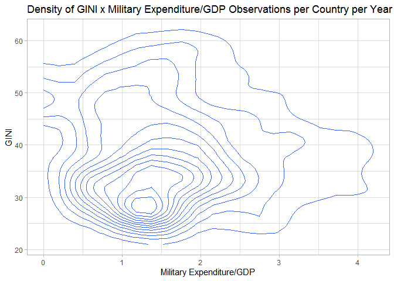
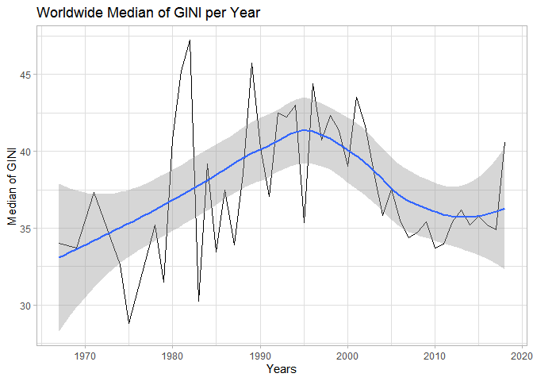
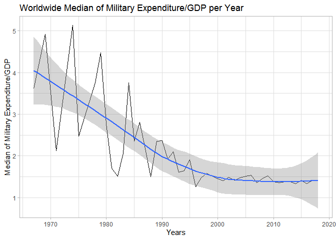
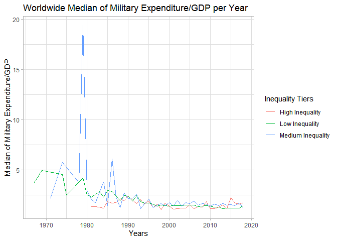

Exploring World Bank Data
================
Gustavo Arruda Franco

## Load necessary libraries

``` r
library(tidyverse)
```

    ## -- Attaching packages ---------------------------------------------------------- tidyverse 1.3.0 --

    ## v ggplot2 3.3.2     v purrr   0.3.4
    ## v tibble  3.0.3     v dplyr   1.0.2
    ## v tidyr   1.1.2     v stringr 1.4.0
    ## v readr   1.3.1     v forcats 0.5.0

    ## -- Conflicts ------------------------------------------------------------- tidyverse_conflicts() --
    ## x dplyr::filter() masks stats::filter()
    ## x dplyr::lag()    masks stats::lag()

``` r
theme_set(theme_light())
```

## Write a function to import the data files

``` r
import_data <- function(a){
  read_csv(a, skip = 4) %>% #Skip first 4 misleading rows
  select(-c(X65, `Indicator Name`)) %>% #Drop unnecessary columns
  pivot_longer(cols = c(4:63), names_to = "Year", names_transform = list(Year = as.double), values_to = "Value") %>% #Transform column names referencing years into a single numerical variable
  pivot_wider(names_from = "Indicator Code", values_from = "Value") %>% #Transform rows of Indicators into columns
  select("Country Name", "Year", GINI = "SI.POV.GINI", Military_Exp_GDP = "MS.MIL.XPND.GD.ZS") %>% #Select relevant variables
  drop_na() #Drop rows with empty values
}
```

## Import the data

``` r
full_countries <- dir("data_world_bank", pattern = "\\.csv$", full.names = TRUE) #Save all file paths into a vector
wb_gini_military <- map_df(full_countries, import_data) #Iterate importing function through vector of file paths, creating an unified data frame
```

    ## Warning: Missing column names filled in: 'X65' [65]

    ## Parsed with column specification:
    ## cols(
    ##   .default = col_double(),
    ##   `Country Name` = col_character(),
    ##   `Country Code` = col_character(),
    ##   `Indicator Name` = col_character(),
    ##   `Indicator Code` = col_character(),
    ##   X65 = col_logical()
    ## )

    ## See spec(...) for full column specifications.

    ## Warning: Missing column names filled in: 'X65' [65]

    ## Parsed with column specification:
    ## cols(
    ##   .default = col_double(),
    ##   `Country Name` = col_character(),
    ##   `Country Code` = col_character(),
    ##   `Indicator Name` = col_character(),
    ##   `Indicator Code` = col_character(),
    ##   X65 = col_logical()
    ## )
    ## See spec(...) for full column specifications.

    ## Warning: Missing column names filled in: 'X65' [65]

    ## Parsed with column specification:
    ## cols(
    ##   .default = col_double(),
    ##   `Country Name` = col_character(),
    ##   `Country Code` = col_character(),
    ##   `Indicator Name` = col_character(),
    ##   `Indicator Code` = col_character(),
    ##   X65 = col_logical()
    ## )
    ## See spec(...) for full column specifications.

    ## Warning: Missing column names filled in: 'X65' [65]

    ## Parsed with column specification:
    ## cols(
    ##   .default = col_double(),
    ##   `Country Name` = col_character(),
    ##   `Country Code` = col_character(),
    ##   `Indicator Name` = col_character(),
    ##   `Indicator Code` = col_character(),
    ##   X65 = col_logical()
    ## )
    ## See spec(...) for full column specifications.

    ## Warning: Missing column names filled in: 'X65' [65]

    ## Parsed with column specification:
    ## cols(
    ##   .default = col_double(),
    ##   `Country Name` = col_character(),
    ##   `Country Code` = col_character(),
    ##   `Indicator Name` = col_character(),
    ##   `Indicator Code` = col_character(),
    ##   X65 = col_logical()
    ## )
    ## See spec(...) for full column specifications.

    ## Warning: Missing column names filled in: 'X65' [65]

    ## Parsed with column specification:
    ## cols(
    ##   .default = col_double(),
    ##   `Country Name` = col_character(),
    ##   `Country Code` = col_character(),
    ##   `Indicator Name` = col_character(),
    ##   `Indicator Code` = col_character(),
    ##   X65 = col_logical()
    ## )
    ## See spec(...) for full column specifications.

    ## Warning: Missing column names filled in: 'X65' [65]

    ## Parsed with column specification:
    ## cols(
    ##   .default = col_double(),
    ##   `Country Name` = col_character(),
    ##   `Country Code` = col_character(),
    ##   `Indicator Name` = col_character(),
    ##   `Indicator Code` = col_character(),
    ##   X65 = col_logical()
    ## )
    ## See spec(...) for full column specifications.

    ## Warning: Missing column names filled in: 'X65' [65]

    ## Parsed with column specification:
    ## cols(
    ##   .default = col_double(),
    ##   `Country Name` = col_character(),
    ##   `Country Code` = col_character(),
    ##   `Indicator Name` = col_character(),
    ##   `Indicator Code` = col_character(),
    ##   X65 = col_logical()
    ## )
    ## See spec(...) for full column specifications.

    ## Warning: Missing column names filled in: 'X65' [65]

    ## Parsed with column specification:
    ## cols(
    ##   .default = col_double(),
    ##   `Country Name` = col_character(),
    ##   `Country Code` = col_character(),
    ##   `Indicator Name` = col_character(),
    ##   `Indicator Code` = col_character(),
    ##   X65 = col_logical()
    ## )
    ## See spec(...) for full column specifications.

    ## Warning: Missing column names filled in: 'X65' [65]

    ## Parsed with column specification:
    ## cols(
    ##   .default = col_double(),
    ##   `Country Name` = col_character(),
    ##   `Country Code` = col_character(),
    ##   `Indicator Name` = col_character(),
    ##   `Indicator Code` = col_character(),
    ##   X65 = col_logical()
    ## )
    ## See spec(...) for full column specifications.

    ## Warning: Missing column names filled in: 'X65' [65]

    ## Parsed with column specification:
    ## cols(
    ##   .default = col_double(),
    ##   `Country Name` = col_character(),
    ##   `Country Code` = col_character(),
    ##   `Indicator Name` = col_character(),
    ##   `Indicator Code` = col_character(),
    ##   X65 = col_logical()
    ## )
    ## See spec(...) for full column specifications.

    ## Warning: Missing column names filled in: 'X65' [65]

    ## Parsed with column specification:
    ## cols(
    ##   .default = col_double(),
    ##   `Country Name` = col_character(),
    ##   `Country Code` = col_character(),
    ##   `Indicator Name` = col_character(),
    ##   `Indicator Code` = col_character(),
    ##   X65 = col_logical()
    ## )
    ## See spec(...) for full column specifications.

    ## Warning: Missing column names filled in: 'X65' [65]

    ## Parsed with column specification:
    ## cols(
    ##   .default = col_double(),
    ##   `Country Name` = col_character(),
    ##   `Country Code` = col_character(),
    ##   `Indicator Name` = col_character(),
    ##   `Indicator Code` = col_character(),
    ##   X65 = col_logical()
    ## )
    ## See spec(...) for full column specifications.

    ## Warning: Missing column names filled in: 'X65' [65]

    ## Parsed with column specification:
    ## cols(
    ##   .default = col_double(),
    ##   `Country Name` = col_character(),
    ##   `Country Code` = col_character(),
    ##   `Indicator Name` = col_character(),
    ##   `Indicator Code` = col_character(),
    ##   X65 = col_logical()
    ## )
    ## See spec(...) for full column specifications.

    ## Warning: Missing column names filled in: 'X65' [65]

    ## Parsed with column specification:
    ## cols(
    ##   .default = col_double(),
    ##   `Country Name` = col_character(),
    ##   `Country Code` = col_character(),
    ##   `Indicator Name` = col_character(),
    ##   `Indicator Code` = col_character(),
    ##   X65 = col_logical()
    ## )
    ## See spec(...) for full column specifications.

    ## Warning: Missing column names filled in: 'X65' [65]

    ## Parsed with column specification:
    ## cols(
    ##   .default = col_double(),
    ##   `Country Name` = col_character(),
    ##   `Country Code` = col_character(),
    ##   `Indicator Name` = col_character(),
    ##   `Indicator Code` = col_character(),
    ##   X65 = col_logical()
    ## )
    ## See spec(...) for full column specifications.

    ## Warning: Missing column names filled in: 'X65' [65]

    ## Parsed with column specification:
    ## cols(
    ##   .default = col_double(),
    ##   `Country Name` = col_character(),
    ##   `Country Code` = col_character(),
    ##   `Indicator Name` = col_character(),
    ##   `Indicator Code` = col_character(),
    ##   X65 = col_logical()
    ## )
    ## See spec(...) for full column specifications.

    ## Warning: Missing column names filled in: 'X65' [65]

    ## Parsed with column specification:
    ## cols(
    ##   .default = col_double(),
    ##   `Country Name` = col_character(),
    ##   `Country Code` = col_character(),
    ##   `Indicator Name` = col_character(),
    ##   `Indicator Code` = col_character(),
    ##   X65 = col_logical()
    ## )
    ## See spec(...) for full column specifications.

    ## Warning: Missing column names filled in: 'X65' [65]

    ## Parsed with column specification:
    ## cols(
    ##   .default = col_double(),
    ##   `Country Name` = col_character(),
    ##   `Country Code` = col_character(),
    ##   `Indicator Name` = col_character(),
    ##   `Indicator Code` = col_character(),
    ##   X65 = col_logical()
    ## )
    ## See spec(...) for full column specifications.

    ## Warning: Missing column names filled in: 'X65' [65]

    ## Parsed with column specification:
    ## cols(
    ##   .default = col_double(),
    ##   `Country Name` = col_character(),
    ##   `Country Code` = col_character(),
    ##   `Indicator Name` = col_character(),
    ##   `Indicator Code` = col_character(),
    ##   X65 = col_logical()
    ## )
    ## See spec(...) for full column specifications.

    ## Warning: Missing column names filled in: 'X65' [65]

    ## Parsed with column specification:
    ## cols(
    ##   .default = col_double(),
    ##   `Country Name` = col_character(),
    ##   `Country Code` = col_character(),
    ##   `Indicator Name` = col_character(),
    ##   `Indicator Code` = col_character(),
    ##   X65 = col_logical()
    ## )
    ## See spec(...) for full column specifications.

    ## Warning: Missing column names filled in: 'X65' [65]

    ## Parsed with column specification:
    ## cols(
    ##   .default = col_double(),
    ##   `Country Name` = col_character(),
    ##   `Country Code` = col_character(),
    ##   `Indicator Name` = col_character(),
    ##   `Indicator Code` = col_character(),
    ##   X65 = col_logical()
    ## )
    ## See spec(...) for full column specifications.

    ## Warning: Missing column names filled in: 'X65' [65]

    ## Parsed with column specification:
    ## cols(
    ##   .default = col_double(),
    ##   `Country Name` = col_character(),
    ##   `Country Code` = col_character(),
    ##   `Indicator Name` = col_character(),
    ##   `Indicator Code` = col_character(),
    ##   X65 = col_logical()
    ## )
    ## See spec(...) for full column specifications.

    ## Warning: Missing column names filled in: 'X65' [65]

    ## Parsed with column specification:
    ## cols(
    ##   .default = col_double(),
    ##   `Country Name` = col_character(),
    ##   `Country Code` = col_character(),
    ##   `Indicator Name` = col_character(),
    ##   `Indicator Code` = col_character(),
    ##   X65 = col_logical()
    ## )
    ## See spec(...) for full column specifications.

    ## Warning: Missing column names filled in: 'X65' [65]

    ## Parsed with column specification:
    ## cols(
    ##   .default = col_double(),
    ##   `Country Name` = col_character(),
    ##   `Country Code` = col_character(),
    ##   `Indicator Name` = col_character(),
    ##   `Indicator Code` = col_character(),
    ##   X65 = col_logical()
    ## )
    ## See spec(...) for full column specifications.

    ## Warning: Missing column names filled in: 'X65' [65]

    ## Parsed with column specification:
    ## cols(
    ##   .default = col_double(),
    ##   `Country Name` = col_character(),
    ##   `Country Code` = col_character(),
    ##   `Indicator Name` = col_character(),
    ##   `Indicator Code` = col_character(),
    ##   X65 = col_logical()
    ## )
    ## See spec(...) for full column specifications.

    ## Warning: Missing column names filled in: 'X65' [65]

    ## Parsed with column specification:
    ## cols(
    ##   .default = col_double(),
    ##   `Country Name` = col_character(),
    ##   `Country Code` = col_character(),
    ##   `Indicator Name` = col_character(),
    ##   `Indicator Code` = col_character(),
    ##   X65 = col_logical()
    ## )
    ## See spec(...) for full column specifications.

    ## Warning: Missing column names filled in: 'X65' [65]

    ## Parsed with column specification:
    ## cols(
    ##   .default = col_double(),
    ##   `Country Name` = col_character(),
    ##   `Country Code` = col_character(),
    ##   `Indicator Name` = col_character(),
    ##   `Indicator Code` = col_character(),
    ##   X65 = col_logical()
    ## )
    ## See spec(...) for full column specifications.

    ## Warning: Missing column names filled in: 'X65' [65]

    ## Parsed with column specification:
    ## cols(
    ##   .default = col_double(),
    ##   `Country Name` = col_character(),
    ##   `Country Code` = col_character(),
    ##   `Indicator Name` = col_character(),
    ##   `Indicator Code` = col_character(),
    ##   X65 = col_logical()
    ## )
    ## See spec(...) for full column specifications.

    ## Warning: Missing column names filled in: 'X65' [65]

    ## Parsed with column specification:
    ## cols(
    ##   .default = col_double(),
    ##   `Country Name` = col_character(),
    ##   `Country Code` = col_character(),
    ##   `Indicator Name` = col_character(),
    ##   `Indicator Code` = col_character(),
    ##   X65 = col_logical()
    ## )
    ## See spec(...) for full column specifications.

    ## Warning: Missing column names filled in: 'X65' [65]

    ## Parsed with column specification:
    ## cols(
    ##   .default = col_double(),
    ##   `Country Name` = col_character(),
    ##   `Country Code` = col_character(),
    ##   `Indicator Name` = col_character(),
    ##   `Indicator Code` = col_character(),
    ##   X65 = col_logical()
    ## )
    ## See spec(...) for full column specifications.

    ## Warning: Missing column names filled in: 'X65' [65]

    ## Parsed with column specification:
    ## cols(
    ##   .default = col_double(),
    ##   `Country Name` = col_character(),
    ##   `Country Code` = col_character(),
    ##   `Indicator Name` = col_character(),
    ##   `Indicator Code` = col_character(),
    ##   X65 = col_logical()
    ## )
    ## See spec(...) for full column specifications.

    ## Warning: Missing column names filled in: 'X65' [65]

    ## Parsed with column specification:
    ## cols(
    ##   .default = col_double(),
    ##   `Country Name` = col_character(),
    ##   `Country Code` = col_character(),
    ##   `Indicator Name` = col_character(),
    ##   `Indicator Code` = col_character(),
    ##   X65 = col_logical()
    ## )
    ## See spec(...) for full column specifications.

    ## Warning: Missing column names filled in: 'X65' [65]

    ## Parsed with column specification:
    ## cols(
    ##   .default = col_double(),
    ##   `Country Name` = col_character(),
    ##   `Country Code` = col_character(),
    ##   `Indicator Name` = col_character(),
    ##   `Indicator Code` = col_character(),
    ##   X65 = col_logical()
    ## )
    ## See spec(...) for full column specifications.

    ## Warning: Missing column names filled in: 'X65' [65]

    ## Parsed with column specification:
    ## cols(
    ##   .default = col_double(),
    ##   `Country Name` = col_character(),
    ##   `Country Code` = col_character(),
    ##   `Indicator Name` = col_character(),
    ##   `Indicator Code` = col_character(),
    ##   X65 = col_logical()
    ## )
    ## See spec(...) for full column specifications.

    ## Warning: Missing column names filled in: 'X65' [65]

    ## Parsed with column specification:
    ## cols(
    ##   .default = col_double(),
    ##   `Country Name` = col_character(),
    ##   `Country Code` = col_character(),
    ##   `Indicator Name` = col_character(),
    ##   `Indicator Code` = col_character(),
    ##   X65 = col_logical()
    ## )
    ## See spec(...) for full column specifications.

    ## Warning: Missing column names filled in: 'X65' [65]

    ## Parsed with column specification:
    ## cols(
    ##   .default = col_double(),
    ##   `Country Name` = col_character(),
    ##   `Country Code` = col_character(),
    ##   `Indicator Name` = col_character(),
    ##   `Indicator Code` = col_character(),
    ##   X65 = col_logical()
    ## )
    ## See spec(...) for full column specifications.

    ## Warning: Missing column names filled in: 'X65' [65]

    ## Parsed with column specification:
    ## cols(
    ##   .default = col_double(),
    ##   `Country Name` = col_character(),
    ##   `Country Code` = col_character(),
    ##   `Indicator Name` = col_character(),
    ##   `Indicator Code` = col_character(),
    ##   X65 = col_logical()
    ## )
    ## See spec(...) for full column specifications.

    ## Warning: Missing column names filled in: 'X65' [65]

    ## Parsed with column specification:
    ## cols(
    ##   .default = col_double(),
    ##   `Country Name` = col_character(),
    ##   `Country Code` = col_character(),
    ##   `Indicator Name` = col_character(),
    ##   `Indicator Code` = col_character(),
    ##   X65 = col_logical()
    ## )
    ## See spec(...) for full column specifications.

    ## Warning: Missing column names filled in: 'X65' [65]

    ## Parsed with column specification:
    ## cols(
    ##   .default = col_double(),
    ##   `Country Name` = col_character(),
    ##   `Country Code` = col_character(),
    ##   `Indicator Name` = col_character(),
    ##   `Indicator Code` = col_character(),
    ##   X65 = col_logical()
    ## )
    ## See spec(...) for full column specifications.

    ## Warning: Missing column names filled in: 'X65' [65]

    ## Parsed with column specification:
    ## cols(
    ##   .default = col_double(),
    ##   `Country Name` = col_character(),
    ##   `Country Code` = col_character(),
    ##   `Indicator Name` = col_character(),
    ##   `Indicator Code` = col_character(),
    ##   X65 = col_logical()
    ## )
    ## See spec(...) for full column specifications.

    ## Warning: Missing column names filled in: 'X65' [65]

    ## Parsed with column specification:
    ## cols(
    ##   .default = col_double(),
    ##   `Country Name` = col_character(),
    ##   `Country Code` = col_character(),
    ##   `Indicator Name` = col_character(),
    ##   `Indicator Code` = col_character(),
    ##   X65 = col_logical()
    ## )
    ## See spec(...) for full column specifications.

    ## Warning: Missing column names filled in: 'X65' [65]

    ## Parsed with column specification:
    ## cols(
    ##   .default = col_double(),
    ##   `Country Name` = col_character(),
    ##   `Country Code` = col_character(),
    ##   `Indicator Name` = col_character(),
    ##   `Indicator Code` = col_character(),
    ##   X65 = col_logical()
    ## )
    ## See spec(...) for full column specifications.

    ## Warning: Missing column names filled in: 'X65' [65]

    ## Parsed with column specification:
    ## cols(
    ##   .default = col_double(),
    ##   `Country Name` = col_character(),
    ##   `Country Code` = col_character(),
    ##   `Indicator Name` = col_character(),
    ##   `Indicator Code` = col_character(),
    ##   X65 = col_logical()
    ## )
    ## See spec(...) for full column specifications.

    ## Warning: Missing column names filled in: 'X65' [65]

    ## Parsed with column specification:
    ## cols(
    ##   .default = col_double(),
    ##   `Country Name` = col_character(),
    ##   `Country Code` = col_character(),
    ##   `Indicator Name` = col_character(),
    ##   `Indicator Code` = col_character(),
    ##   X65 = col_logical()
    ## )
    ## See spec(...) for full column specifications.

    ## Warning: Missing column names filled in: 'X65' [65]

    ## Parsed with column specification:
    ## cols(
    ##   .default = col_double(),
    ##   `Country Name` = col_character(),
    ##   `Country Code` = col_character(),
    ##   `Indicator Name` = col_character(),
    ##   `Indicator Code` = col_character(),
    ##   X65 = col_logical()
    ## )
    ## See spec(...) for full column specifications.

    ## Warning: Missing column names filled in: 'X65' [65]

    ## Parsed with column specification:
    ## cols(
    ##   .default = col_double(),
    ##   `Country Name` = col_character(),
    ##   `Country Code` = col_character(),
    ##   `Indicator Name` = col_character(),
    ##   `Indicator Code` = col_character(),
    ##   X65 = col_logical()
    ## )
    ## See spec(...) for full column specifications.

    ## Warning: Missing column names filled in: 'X65' [65]

    ## Parsed with column specification:
    ## cols(
    ##   .default = col_double(),
    ##   `Country Name` = col_character(),
    ##   `Country Code` = col_character(),
    ##   `Indicator Name` = col_character(),
    ##   `Indicator Code` = col_character(),
    ##   X65 = col_logical()
    ## )
    ## See spec(...) for full column specifications.

    ## Warning: Missing column names filled in: 'X65' [65]

    ## Parsed with column specification:
    ## cols(
    ##   .default = col_double(),
    ##   `Country Name` = col_character(),
    ##   `Country Code` = col_character(),
    ##   `Indicator Name` = col_character(),
    ##   `Indicator Code` = col_character(),
    ##   X65 = col_logical()
    ## )
    ## See spec(...) for full column specifications.

    ## Warning: Missing column names filled in: 'X65' [65]

    ## Parsed with column specification:
    ## cols(
    ##   .default = col_double(),
    ##   `Country Name` = col_character(),
    ##   `Country Code` = col_character(),
    ##   `Indicator Name` = col_character(),
    ##   `Indicator Code` = col_character(),
    ##   X65 = col_logical()
    ## )
    ## See spec(...) for full column specifications.

    ## Warning: Missing column names filled in: 'X65' [65]

    ## Parsed with column specification:
    ## cols(
    ##   .default = col_double(),
    ##   `Country Name` = col_character(),
    ##   `Country Code` = col_character(),
    ##   `Indicator Name` = col_character(),
    ##   `Indicator Code` = col_character(),
    ##   X65 = col_logical()
    ## )
    ## See spec(...) for full column specifications.

    ## Warning: Missing column names filled in: 'X65' [65]

    ## Parsed with column specification:
    ## cols(
    ##   .default = col_double(),
    ##   `Country Name` = col_character(),
    ##   `Country Code` = col_character(),
    ##   `Indicator Name` = col_character(),
    ##   `Indicator Code` = col_character(),
    ##   X65 = col_logical()
    ## )
    ## See spec(...) for full column specifications.

    ## Warning: Missing column names filled in: 'X65' [65]

    ## Parsed with column specification:
    ## cols(
    ##   .default = col_double(),
    ##   `Country Name` = col_character(),
    ##   `Country Code` = col_character(),
    ##   `Indicator Name` = col_character(),
    ##   `Indicator Code` = col_character(),
    ##   X65 = col_logical()
    ## )
    ## See spec(...) for full column specifications.

    ## Warning: Missing column names filled in: 'X65' [65]

    ## Parsed with column specification:
    ## cols(
    ##   .default = col_double(),
    ##   `Country Name` = col_character(),
    ##   `Country Code` = col_character(),
    ##   `Indicator Name` = col_character(),
    ##   `Indicator Code` = col_character(),
    ##   X65 = col_logical()
    ## )
    ## See spec(...) for full column specifications.

    ## Warning: Missing column names filled in: 'X65' [65]

    ## Parsed with column specification:
    ## cols(
    ##   .default = col_double(),
    ##   `Country Name` = col_character(),
    ##   `Country Code` = col_character(),
    ##   `Indicator Name` = col_character(),
    ##   `Indicator Code` = col_character(),
    ##   X65 = col_logical()
    ## )
    ## See spec(...) for full column specifications.

    ## Warning: Missing column names filled in: 'X65' [65]

    ## Parsed with column specification:
    ## cols(
    ##   .default = col_double(),
    ##   `Country Name` = col_character(),
    ##   `Country Code` = col_character(),
    ##   `Indicator Name` = col_character(),
    ##   `Indicator Code` = col_character(),
    ##   X65 = col_logical()
    ## )
    ## See spec(...) for full column specifications.

    ## Warning: Missing column names filled in: 'X65' [65]

    ## Parsed with column specification:
    ## cols(
    ##   .default = col_double(),
    ##   `Country Name` = col_character(),
    ##   `Country Code` = col_character(),
    ##   `Indicator Name` = col_character(),
    ##   `Indicator Code` = col_character(),
    ##   X65 = col_logical()
    ## )
    ## See spec(...) for full column specifications.

    ## Warning: Missing column names filled in: 'X65' [65]

    ## Parsed with column specification:
    ## cols(
    ##   .default = col_double(),
    ##   `Country Name` = col_character(),
    ##   `Country Code` = col_character(),
    ##   `Indicator Name` = col_character(),
    ##   `Indicator Code` = col_character(),
    ##   X65 = col_logical()
    ## )
    ## See spec(...) for full column specifications.

    ## Warning: Missing column names filled in: 'X65' [65]

    ## Parsed with column specification:
    ## cols(
    ##   .default = col_double(),
    ##   `Country Name` = col_character(),
    ##   `Country Code` = col_character(),
    ##   `Indicator Name` = col_character(),
    ##   `Indicator Code` = col_character(),
    ##   X65 = col_logical()
    ## )
    ## See spec(...) for full column specifications.

    ## Warning: Missing column names filled in: 'X65' [65]

    ## Parsed with column specification:
    ## cols(
    ##   .default = col_double(),
    ##   `Country Name` = col_character(),
    ##   `Country Code` = col_character(),
    ##   `Indicator Name` = col_character(),
    ##   `Indicator Code` = col_character(),
    ##   X65 = col_logical()
    ## )
    ## See spec(...) for full column specifications.

    ## Warning: Missing column names filled in: 'X65' [65]

    ## Parsed with column specification:
    ## cols(
    ##   .default = col_double(),
    ##   `Country Name` = col_character(),
    ##   `Country Code` = col_character(),
    ##   `Indicator Name` = col_character(),
    ##   `Indicator Code` = col_character(),
    ##   X65 = col_logical()
    ## )
    ## See spec(...) for full column specifications.

    ## Warning: Missing column names filled in: 'X65' [65]

    ## Parsed with column specification:
    ## cols(
    ##   .default = col_double(),
    ##   `Country Name` = col_character(),
    ##   `Country Code` = col_character(),
    ##   `Indicator Name` = col_character(),
    ##   `Indicator Code` = col_character(),
    ##   X65 = col_logical()
    ## )
    ## See spec(...) for full column specifications.

    ## Warning: Missing column names filled in: 'X65' [65]

    ## Parsed with column specification:
    ## cols(
    ##   .default = col_double(),
    ##   `Country Name` = col_character(),
    ##   `Country Code` = col_character(),
    ##   `Indicator Name` = col_character(),
    ##   `Indicator Code` = col_character(),
    ##   X65 = col_logical()
    ## )
    ## See spec(...) for full column specifications.

    ## Warning: Missing column names filled in: 'X65' [65]

    ## Parsed with column specification:
    ## cols(
    ##   .default = col_double(),
    ##   `Country Name` = col_character(),
    ##   `Country Code` = col_character(),
    ##   `Indicator Name` = col_character(),
    ##   `Indicator Code` = col_character(),
    ##   X65 = col_logical()
    ## )
    ## See spec(...) for full column specifications.

    ## Warning: Missing column names filled in: 'X65' [65]

    ## Parsed with column specification:
    ## cols(
    ##   .default = col_double(),
    ##   `Country Name` = col_character(),
    ##   `Country Code` = col_character(),
    ##   `Indicator Name` = col_character(),
    ##   `Indicator Code` = col_character(),
    ##   X65 = col_logical()
    ## )
    ## See spec(...) for full column specifications.

    ## Warning: Missing column names filled in: 'X65' [65]

    ## Parsed with column specification:
    ## cols(
    ##   .default = col_double(),
    ##   `Country Name` = col_character(),
    ##   `Country Code` = col_character(),
    ##   `Indicator Name` = col_character(),
    ##   `Indicator Code` = col_character(),
    ##   X65 = col_logical()
    ## )
    ## See spec(...) for full column specifications.

    ## Warning: Missing column names filled in: 'X65' [65]

    ## Parsed with column specification:
    ## cols(
    ##   .default = col_double(),
    ##   `Country Name` = col_character(),
    ##   `Country Code` = col_character(),
    ##   `Indicator Name` = col_character(),
    ##   `Indicator Code` = col_character(),
    ##   X65 = col_logical()
    ## )
    ## See spec(...) for full column specifications.

    ## Warning: Missing column names filled in: 'X65' [65]

    ## Parsed with column specification:
    ## cols(
    ##   .default = col_double(),
    ##   `Country Name` = col_character(),
    ##   `Country Code` = col_character(),
    ##   `Indicator Name` = col_character(),
    ##   `Indicator Code` = col_character(),
    ##   X65 = col_logical()
    ## )
    ## See spec(...) for full column specifications.

    ## Warning: Missing column names filled in: 'X65' [65]

    ## Parsed with column specification:
    ## cols(
    ##   .default = col_double(),
    ##   `Country Name` = col_character(),
    ##   `Country Code` = col_character(),
    ##   `Indicator Name` = col_character(),
    ##   `Indicator Code` = col_character(),
    ##   X65 = col_logical()
    ## )
    ## See spec(...) for full column specifications.

    ## Warning: Missing column names filled in: 'X65' [65]

    ## Parsed with column specification:
    ## cols(
    ##   .default = col_double(),
    ##   `Country Name` = col_character(),
    ##   `Country Code` = col_character(),
    ##   `Indicator Name` = col_character(),
    ##   `Indicator Code` = col_character(),
    ##   X65 = col_logical()
    ## )
    ## See spec(...) for full column specifications.

    ## Warning: Missing column names filled in: 'X65' [65]

    ## Parsed with column specification:
    ## cols(
    ##   .default = col_double(),
    ##   `Country Name` = col_character(),
    ##   `Country Code` = col_character(),
    ##   `Indicator Name` = col_character(),
    ##   `Indicator Code` = col_character(),
    ##   X65 = col_logical()
    ## )
    ## See spec(...) for full column specifications.

    ## Warning: Missing column names filled in: 'X65' [65]

    ## Parsed with column specification:
    ## cols(
    ##   .default = col_double(),
    ##   `Country Name` = col_character(),
    ##   `Country Code` = col_character(),
    ##   `Indicator Name` = col_character(),
    ##   `Indicator Code` = col_character(),
    ##   X65 = col_logical()
    ## )
    ## See spec(...) for full column specifications.

    ## Warning: Missing column names filled in: 'X65' [65]

    ## Parsed with column specification:
    ## cols(
    ##   .default = col_double(),
    ##   `Country Name` = col_character(),
    ##   `Country Code` = col_character(),
    ##   `Indicator Name` = col_character(),
    ##   `Indicator Code` = col_character(),
    ##   X65 = col_logical()
    ## )
    ## See spec(...) for full column specifications.

    ## Warning: Missing column names filled in: 'X65' [65]

    ## Parsed with column specification:
    ## cols(
    ##   .default = col_double(),
    ##   `Country Name` = col_character(),
    ##   `Country Code` = col_character(),
    ##   `Indicator Name` = col_character(),
    ##   `Indicator Code` = col_character(),
    ##   X65 = col_logical()
    ## )
    ## See spec(...) for full column specifications.

    ## Warning: Missing column names filled in: 'X65' [65]

    ## Parsed with column specification:
    ## cols(
    ##   .default = col_double(),
    ##   `Country Name` = col_character(),
    ##   `Country Code` = col_character(),
    ##   `Indicator Name` = col_character(),
    ##   `Indicator Code` = col_character(),
    ##   X65 = col_logical()
    ## )
    ## See spec(...) for full column specifications.

    ## Warning: Missing column names filled in: 'X65' [65]

    ## Parsed with column specification:
    ## cols(
    ##   .default = col_double(),
    ##   `Country Name` = col_character(),
    ##   `Country Code` = col_character(),
    ##   `Indicator Name` = col_character(),
    ##   `Indicator Code` = col_character(),
    ##   X65 = col_logical()
    ## )
    ## See spec(...) for full column specifications.

    ## Warning: Missing column names filled in: 'X65' [65]

    ## Parsed with column specification:
    ## cols(
    ##   .default = col_double(),
    ##   `Country Name` = col_character(),
    ##   `Country Code` = col_character(),
    ##   `Indicator Name` = col_character(),
    ##   `Indicator Code` = col_character(),
    ##   X65 = col_logical()
    ## )
    ## See spec(...) for full column specifications.

    ## Warning: Missing column names filled in: 'X65' [65]

    ## Parsed with column specification:
    ## cols(
    ##   .default = col_double(),
    ##   `Country Name` = col_character(),
    ##   `Country Code` = col_character(),
    ##   `Indicator Name` = col_character(),
    ##   `Indicator Code` = col_character(),
    ##   X65 = col_logical()
    ## )
    ## See spec(...) for full column specifications.

    ## Warning: Missing column names filled in: 'X65' [65]

    ## Parsed with column specification:
    ## cols(
    ##   .default = col_double(),
    ##   `Country Name` = col_character(),
    ##   `Country Code` = col_character(),
    ##   `Indicator Name` = col_character(),
    ##   `Indicator Code` = col_character(),
    ##   X65 = col_logical()
    ## )
    ## See spec(...) for full column specifications.

    ## Warning: Missing column names filled in: 'X65' [65]

    ## Parsed with column specification:
    ## cols(
    ##   .default = col_double(),
    ##   `Country Name` = col_character(),
    ##   `Country Code` = col_character(),
    ##   `Indicator Name` = col_character(),
    ##   `Indicator Code` = col_character(),
    ##   X65 = col_logical()
    ## )
    ## See spec(...) for full column specifications.

    ## Warning: Missing column names filled in: 'X65' [65]

    ## Parsed with column specification:
    ## cols(
    ##   .default = col_double(),
    ##   `Country Name` = col_character(),
    ##   `Country Code` = col_character(),
    ##   `Indicator Name` = col_character(),
    ##   `Indicator Code` = col_character(),
    ##   X65 = col_logical()
    ## )
    ## See spec(...) for full column specifications.

    ## Warning: Missing column names filled in: 'X65' [65]

    ## Parsed with column specification:
    ## cols(
    ##   .default = col_double(),
    ##   `Country Name` = col_character(),
    ##   `Country Code` = col_character(),
    ##   `Indicator Name` = col_character(),
    ##   `Indicator Code` = col_character(),
    ##   X65 = col_logical()
    ## )
    ## See spec(...) for full column specifications.

    ## Warning: Missing column names filled in: 'X65' [65]

    ## Parsed with column specification:
    ## cols(
    ##   .default = col_double(),
    ##   `Country Name` = col_character(),
    ##   `Country Code` = col_character(),
    ##   `Indicator Name` = col_character(),
    ##   `Indicator Code` = col_character(),
    ##   X65 = col_logical()
    ## )
    ## See spec(...) for full column specifications.

    ## Warning: Missing column names filled in: 'X65' [65]

    ## Parsed with column specification:
    ## cols(
    ##   .default = col_double(),
    ##   `Country Name` = col_character(),
    ##   `Country Code` = col_character(),
    ##   `Indicator Name` = col_character(),
    ##   `Indicator Code` = col_character(),
    ##   X65 = col_logical()
    ## )
    ## See spec(...) for full column specifications.

    ## Warning: Missing column names filled in: 'X65' [65]

    ## Parsed with column specification:
    ## cols(
    ##   .default = col_double(),
    ##   `Country Name` = col_character(),
    ##   `Country Code` = col_character(),
    ##   `Indicator Name` = col_character(),
    ##   `Indicator Code` = col_character(),
    ##   X65 = col_logical()
    ## )
    ## See spec(...) for full column specifications.

    ## Warning: Missing column names filled in: 'X65' [65]

    ## Parsed with column specification:
    ## cols(
    ##   .default = col_double(),
    ##   `Country Name` = col_character(),
    ##   `Country Code` = col_character(),
    ##   `Indicator Name` = col_character(),
    ##   `Indicator Code` = col_character(),
    ##   X65 = col_logical()
    ## )
    ## See spec(...) for full column specifications.

    ## Warning: Missing column names filled in: 'X65' [65]

    ## Parsed with column specification:
    ## cols(
    ##   .default = col_double(),
    ##   `Country Name` = col_character(),
    ##   `Country Code` = col_character(),
    ##   `Indicator Name` = col_character(),
    ##   `Indicator Code` = col_character(),
    ##   X65 = col_logical()
    ## )
    ## See spec(...) for full column specifications.

    ## Warning: Missing column names filled in: 'X65' [65]

    ## Parsed with column specification:
    ## cols(
    ##   .default = col_double(),
    ##   `Country Name` = col_character(),
    ##   `Country Code` = col_character(),
    ##   `Indicator Name` = col_character(),
    ##   `Indicator Code` = col_character(),
    ##   X65 = col_logical()
    ## )
    ## See spec(...) for full column specifications.

    ## Warning: Missing column names filled in: 'X65' [65]

    ## Parsed with column specification:
    ## cols(
    ##   .default = col_double(),
    ##   `Country Name` = col_character(),
    ##   `Country Code` = col_character(),
    ##   `Indicator Name` = col_character(),
    ##   `Indicator Code` = col_character(),
    ##   X65 = col_logical()
    ## )
    ## See spec(...) for full column specifications.

    ## Warning: Missing column names filled in: 'X65' [65]

    ## Parsed with column specification:
    ## cols(
    ##   .default = col_double(),
    ##   `Country Name` = col_character(),
    ##   `Country Code` = col_character(),
    ##   `Indicator Name` = col_character(),
    ##   `Indicator Code` = col_character(),
    ##   X65 = col_logical()
    ## )
    ## See spec(...) for full column specifications.

    ## Warning: Missing column names filled in: 'X65' [65]

    ## Parsed with column specification:
    ## cols(
    ##   .default = col_double(),
    ##   `Country Name` = col_character(),
    ##   `Country Code` = col_character(),
    ##   `Indicator Name` = col_character(),
    ##   `Indicator Code` = col_character(),
    ##   X65 = col_logical()
    ## )
    ## See spec(...) for full column specifications.

    ## Warning: Missing column names filled in: 'X65' [65]

    ## Parsed with column specification:
    ## cols(
    ##   .default = col_double(),
    ##   `Country Name` = col_character(),
    ##   `Country Code` = col_character(),
    ##   `Indicator Name` = col_character(),
    ##   `Indicator Code` = col_character(),
    ##   X65 = col_logical()
    ## )
    ## See spec(...) for full column specifications.

    ## Warning: Missing column names filled in: 'X65' [65]

    ## Parsed with column specification:
    ## cols(
    ##   .default = col_double(),
    ##   `Country Name` = col_character(),
    ##   `Country Code` = col_character(),
    ##   `Indicator Name` = col_character(),
    ##   `Indicator Code` = col_character(),
    ##   X65 = col_logical()
    ## )
    ## See spec(...) for full column specifications.

    ## Warning: Missing column names filled in: 'X65' [65]

    ## Parsed with column specification:
    ## cols(
    ##   .default = col_double(),
    ##   `Country Name` = col_character(),
    ##   `Country Code` = col_character(),
    ##   `Indicator Name` = col_character(),
    ##   `Indicator Code` = col_character(),
    ##   X65 = col_logical()
    ## )
    ## See spec(...) for full column specifications.

    ## Warning: Missing column names filled in: 'X65' [65]

    ## Parsed with column specification:
    ## cols(
    ##   .default = col_double(),
    ##   `Country Name` = col_character(),
    ##   `Country Code` = col_character(),
    ##   `Indicator Name` = col_character(),
    ##   `Indicator Code` = col_character(),
    ##   X65 = col_logical()
    ## )
    ## See spec(...) for full column specifications.

    ## Warning: Missing column names filled in: 'X65' [65]

    ## Parsed with column specification:
    ## cols(
    ##   .default = col_double(),
    ##   `Country Name` = col_character(),
    ##   `Country Code` = col_character(),
    ##   `Indicator Name` = col_character(),
    ##   `Indicator Code` = col_character(),
    ##   X65 = col_logical()
    ## )
    ## See spec(...) for full column specifications.

    ## Warning: Missing column names filled in: 'X65' [65]

    ## Parsed with column specification:
    ## cols(
    ##   .default = col_double(),
    ##   `Country Name` = col_character(),
    ##   `Country Code` = col_character(),
    ##   `Indicator Name` = col_character(),
    ##   `Indicator Code` = col_character(),
    ##   X65 = col_logical()
    ## )
    ## See spec(...) for full column specifications.

    ## Warning: Missing column names filled in: 'X65' [65]

    ## Parsed with column specification:
    ## cols(
    ##   .default = col_double(),
    ##   `Country Name` = col_character(),
    ##   `Country Code` = col_character(),
    ##   `Indicator Name` = col_character(),
    ##   `Indicator Code` = col_character(),
    ##   X65 = col_logical()
    ## )
    ## See spec(...) for full column specifications.

    ## Warning: Missing column names filled in: 'X65' [65]

    ## Parsed with column specification:
    ## cols(
    ##   .default = col_double(),
    ##   `Country Name` = col_character(),
    ##   `Country Code` = col_character(),
    ##   `Indicator Name` = col_character(),
    ##   `Indicator Code` = col_character(),
    ##   X65 = col_logical()
    ## )
    ## See spec(...) for full column specifications.

    ## Warning: Missing column names filled in: 'X65' [65]

    ## Parsed with column specification:
    ## cols(
    ##   .default = col_double(),
    ##   `Country Name` = col_character(),
    ##   `Country Code` = col_character(),
    ##   `Indicator Name` = col_character(),
    ##   `Indicator Code` = col_character(),
    ##   X65 = col_logical()
    ## )
    ## See spec(...) for full column specifications.

    ## Warning: Missing column names filled in: 'X65' [65]

    ## Parsed with column specification:
    ## cols(
    ##   .default = col_double(),
    ##   `Country Name` = col_character(),
    ##   `Country Code` = col_character(),
    ##   `Indicator Name` = col_character(),
    ##   `Indicator Code` = col_character(),
    ##   X65 = col_logical()
    ## )
    ## See spec(...) for full column specifications.

    ## Warning: Missing column names filled in: 'X65' [65]

    ## Parsed with column specification:
    ## cols(
    ##   .default = col_double(),
    ##   `Country Name` = col_character(),
    ##   `Country Code` = col_character(),
    ##   `Indicator Name` = col_character(),
    ##   `Indicator Code` = col_character(),
    ##   X65 = col_logical()
    ## )
    ## See spec(...) for full column specifications.

    ## Warning: Missing column names filled in: 'X65' [65]

    ## Parsed with column specification:
    ## cols(
    ##   .default = col_double(),
    ##   `Country Name` = col_character(),
    ##   `Country Code` = col_character(),
    ##   `Indicator Name` = col_character(),
    ##   `Indicator Code` = col_character(),
    ##   X65 = col_logical()
    ## )
    ## See spec(...) for full column specifications.

    ## Warning: Missing column names filled in: 'X65' [65]

    ## Parsed with column specification:
    ## cols(
    ##   .default = col_double(),
    ##   `Country Name` = col_character(),
    ##   `Country Code` = col_character(),
    ##   `Indicator Name` = col_character(),
    ##   `Indicator Code` = col_character(),
    ##   X65 = col_logical()
    ## )
    ## See spec(...) for full column specifications.

    ## Warning: Missing column names filled in: 'X65' [65]

    ## Parsed with column specification:
    ## cols(
    ##   .default = col_double(),
    ##   `Country Name` = col_character(),
    ##   `Country Code` = col_character(),
    ##   `Indicator Name` = col_character(),
    ##   `Indicator Code` = col_character(),
    ##   X65 = col_logical()
    ## )
    ## See spec(...) for full column specifications.

    ## Warning: Missing column names filled in: 'X65' [65]

    ## Parsed with column specification:
    ## cols(
    ##   .default = col_double(),
    ##   `Country Name` = col_character(),
    ##   `Country Code` = col_character(),
    ##   `Indicator Name` = col_character(),
    ##   `Indicator Code` = col_character(),
    ##   X65 = col_logical()
    ## )
    ## See spec(...) for full column specifications.

    ## Warning: Missing column names filled in: 'X65' [65]

    ## Parsed with column specification:
    ## cols(
    ##   .default = col_double(),
    ##   `Country Name` = col_character(),
    ##   `Country Code` = col_character(),
    ##   `Indicator Name` = col_character(),
    ##   `Indicator Code` = col_character(),
    ##   X65 = col_logical()
    ## )
    ## See spec(...) for full column specifications.

    ## Warning: Missing column names filled in: 'X65' [65]

    ## Parsed with column specification:
    ## cols(
    ##   .default = col_double(),
    ##   `Country Name` = col_character(),
    ##   `Country Code` = col_character(),
    ##   `Indicator Name` = col_character(),
    ##   `Indicator Code` = col_character(),
    ##   X65 = col_logical()
    ## )
    ## See spec(...) for full column specifications.

    ## Warning: Missing column names filled in: 'X65' [65]

    ## Parsed with column specification:
    ## cols(
    ##   .default = col_double(),
    ##   `Country Name` = col_character(),
    ##   `Country Code` = col_character(),
    ##   `Indicator Name` = col_character(),
    ##   `Indicator Code` = col_character(),
    ##   X65 = col_logical()
    ## )
    ## See spec(...) for full column specifications.

    ## Warning: Missing column names filled in: 'X65' [65]

    ## Parsed with column specification:
    ## cols(
    ##   .default = col_double(),
    ##   `Country Name` = col_character(),
    ##   `Country Code` = col_character(),
    ##   `Indicator Name` = col_character(),
    ##   `Indicator Code` = col_character(),
    ##   X65 = col_logical()
    ## )
    ## See spec(...) for full column specifications.

    ## Warning: Missing column names filled in: 'X65' [65]

    ## Parsed with column specification:
    ## cols(
    ##   .default = col_double(),
    ##   `Country Name` = col_character(),
    ##   `Country Code` = col_character(),
    ##   `Indicator Name` = col_character(),
    ##   `Indicator Code` = col_character(),
    ##   X65 = col_logical()
    ## )
    ## See spec(...) for full column specifications.

    ## Warning: Missing column names filled in: 'X65' [65]

    ## Parsed with column specification:
    ## cols(
    ##   .default = col_double(),
    ##   `Country Name` = col_character(),
    ##   `Country Code` = col_character(),
    ##   `Indicator Name` = col_character(),
    ##   `Indicator Code` = col_character(),
    ##   X65 = col_logical()
    ## )
    ## See spec(...) for full column specifications.

    ## Warning: Missing column names filled in: 'X65' [65]

    ## Parsed with column specification:
    ## cols(
    ##   .default = col_double(),
    ##   `Country Name` = col_character(),
    ##   `Country Code` = col_character(),
    ##   `Indicator Name` = col_character(),
    ##   `Indicator Code` = col_character(),
    ##   X65 = col_logical()
    ## )
    ## See spec(...) for full column specifications.

    ## Warning: Missing column names filled in: 'X65' [65]

    ## Parsed with column specification:
    ## cols(
    ##   .default = col_double(),
    ##   `Country Name` = col_character(),
    ##   `Country Code` = col_character(),
    ##   `Indicator Name` = col_character(),
    ##   `Indicator Code` = col_character(),
    ##   X65 = col_logical()
    ## )
    ## See spec(...) for full column specifications.

    ## Warning: Missing column names filled in: 'X65' [65]

    ## Parsed with column specification:
    ## cols(
    ##   .default = col_double(),
    ##   `Country Name` = col_character(),
    ##   `Country Code` = col_character(),
    ##   `Indicator Name` = col_character(),
    ##   `Indicator Code` = col_character(),
    ##   X65 = col_logical()
    ## )
    ## See spec(...) for full column specifications.

    ## Warning: Missing column names filled in: 'X65' [65]

    ## Parsed with column specification:
    ## cols(
    ##   .default = col_double(),
    ##   `Country Name` = col_character(),
    ##   `Country Code` = col_character(),
    ##   `Indicator Name` = col_character(),
    ##   `Indicator Code` = col_character(),
    ##   X65 = col_logical()
    ## )
    ## See spec(...) for full column specifications.

    ## Warning: Missing column names filled in: 'X65' [65]

    ## Parsed with column specification:
    ## cols(
    ##   .default = col_double(),
    ##   `Country Name` = col_character(),
    ##   `Country Code` = col_character(),
    ##   `Indicator Name` = col_character(),
    ##   `Indicator Code` = col_character(),
    ##   X65 = col_logical()
    ## )
    ## See spec(...) for full column specifications.

    ## Warning: Missing column names filled in: 'X65' [65]

    ## Parsed with column specification:
    ## cols(
    ##   .default = col_double(),
    ##   `Country Name` = col_character(),
    ##   `Country Code` = col_character(),
    ##   `Indicator Name` = col_character(),
    ##   `Indicator Code` = col_character(),
    ##   X65 = col_logical()
    ## )
    ## See spec(...) for full column specifications.

    ## Warning: Missing column names filled in: 'X65' [65]

    ## Parsed with column specification:
    ## cols(
    ##   .default = col_double(),
    ##   `Country Name` = col_character(),
    ##   `Country Code` = col_character(),
    ##   `Indicator Name` = col_character(),
    ##   `Indicator Code` = col_character(),
    ##   X65 = col_logical()
    ## )
    ## See spec(...) for full column specifications.

    ## Warning: Missing column names filled in: 'X65' [65]

    ## Parsed with column specification:
    ## cols(
    ##   .default = col_double(),
    ##   `Country Name` = col_character(),
    ##   `Country Code` = col_character(),
    ##   `Indicator Name` = col_character(),
    ##   `Indicator Code` = col_character(),
    ##   X65 = col_logical()
    ## )
    ## See spec(...) for full column specifications.

    ## Warning: Missing column names filled in: 'X65' [65]

    ## Parsed with column specification:
    ## cols(
    ##   .default = col_double(),
    ##   `Country Name` = col_character(),
    ##   `Country Code` = col_character(),
    ##   `Indicator Name` = col_character(),
    ##   `Indicator Code` = col_character(),
    ##   X65 = col_logical()
    ## )
    ## See spec(...) for full column specifications.

    ## Warning: Missing column names filled in: 'X65' [65]

    ## Parsed with column specification:
    ## cols(
    ##   .default = col_double(),
    ##   `Country Name` = col_character(),
    ##   `Country Code` = col_character(),
    ##   `Indicator Name` = col_character(),
    ##   `Indicator Code` = col_character(),
    ##   X65 = col_logical()
    ## )
    ## See spec(...) for full column specifications.

    ## Warning: Missing column names filled in: 'X65' [65]

    ## Parsed with column specification:
    ## cols(
    ##   .default = col_double(),
    ##   `Country Name` = col_character(),
    ##   `Country Code` = col_character(),
    ##   `Indicator Name` = col_character(),
    ##   `Indicator Code` = col_character(),
    ##   X65 = col_logical()
    ## )
    ## See spec(...) for full column specifications.

    ## Warning: Missing column names filled in: 'X65' [65]

    ## Parsed with column specification:
    ## cols(
    ##   .default = col_double(),
    ##   `Country Name` = col_character(),
    ##   `Country Code` = col_character(),
    ##   `Indicator Name` = col_character(),
    ##   `Indicator Code` = col_character(),
    ##   X65 = col_logical()
    ## )
    ## See spec(...) for full column specifications.

    ## Warning: Missing column names filled in: 'X65' [65]

    ## Parsed with column specification:
    ## cols(
    ##   .default = col_double(),
    ##   `Country Name` = col_character(),
    ##   `Country Code` = col_character(),
    ##   `Indicator Name` = col_character(),
    ##   `Indicator Code` = col_character(),
    ##   X65 = col_logical()
    ## )
    ## See spec(...) for full column specifications.

    ## Warning: Missing column names filled in: 'X65' [65]

    ## Parsed with column specification:
    ## cols(
    ##   .default = col_double(),
    ##   `Country Name` = col_character(),
    ##   `Country Code` = col_character(),
    ##   `Indicator Name` = col_character(),
    ##   `Indicator Code` = col_character(),
    ##   X65 = col_logical()
    ## )
    ## See spec(...) for full column specifications.

    ## Warning: Missing column names filled in: 'X65' [65]

    ## Parsed with column specification:
    ## cols(
    ##   .default = col_double(),
    ##   `Country Name` = col_character(),
    ##   `Country Code` = col_character(),
    ##   `Indicator Name` = col_character(),
    ##   `Indicator Code` = col_character(),
    ##   X65 = col_logical()
    ## )
    ## See spec(...) for full column specifications.

    ## Warning: Missing column names filled in: 'X65' [65]

    ## Parsed with column specification:
    ## cols(
    ##   .default = col_double(),
    ##   `Country Name` = col_character(),
    ##   `Country Code` = col_character(),
    ##   `Indicator Name` = col_character(),
    ##   `Indicator Code` = col_character(),
    ##   X65 = col_logical()
    ## )
    ## See spec(...) for full column specifications.

    ## Warning: Missing column names filled in: 'X65' [65]

    ## Parsed with column specification:
    ## cols(
    ##   .default = col_double(),
    ##   `Country Name` = col_character(),
    ##   `Country Code` = col_character(),
    ##   `Indicator Name` = col_character(),
    ##   `Indicator Code` = col_character(),
    ##   X65 = col_logical()
    ## )
    ## See spec(...) for full column specifications.

    ## Warning: Missing column names filled in: 'X65' [65]

    ## Parsed with column specification:
    ## cols(
    ##   .default = col_double(),
    ##   `Country Name` = col_character(),
    ##   `Country Code` = col_character(),
    ##   `Indicator Name` = col_character(),
    ##   `Indicator Code` = col_character(),
    ##   X65 = col_logical()
    ## )
    ## See spec(...) for full column specifications.

    ## Warning: Missing column names filled in: 'X65' [65]

    ## Parsed with column specification:
    ## cols(
    ##   .default = col_double(),
    ##   `Country Name` = col_character(),
    ##   `Country Code` = col_character(),
    ##   `Indicator Name` = col_character(),
    ##   `Indicator Code` = col_character(),
    ##   X65 = col_logical()
    ## )
    ## See spec(...) for full column specifications.

    ## Warning: Missing column names filled in: 'X65' [65]

    ## Parsed with column specification:
    ## cols(
    ##   .default = col_double(),
    ##   `Country Name` = col_character(),
    ##   `Country Code` = col_character(),
    ##   `Indicator Name` = col_character(),
    ##   `Indicator Code` = col_character(),
    ##   X65 = col_logical()
    ## )
    ## See spec(...) for full column specifications.

    ## Warning: Missing column names filled in: 'X65' [65]

    ## Parsed with column specification:
    ## cols(
    ##   .default = col_double(),
    ##   `Country Name` = col_character(),
    ##   `Country Code` = col_character(),
    ##   `Indicator Name` = col_character(),
    ##   `Indicator Code` = col_character(),
    ##   X65 = col_logical()
    ## )
    ## See spec(...) for full column specifications.

    ## Warning: Missing column names filled in: 'X65' [65]

    ## Parsed with column specification:
    ## cols(
    ##   .default = col_double(),
    ##   `Country Name` = col_character(),
    ##   `Country Code` = col_character(),
    ##   `Indicator Name` = col_character(),
    ##   `Indicator Code` = col_character(),
    ##   X65 = col_logical()
    ## )
    ## See spec(...) for full column specifications.

    ## Warning: Missing column names filled in: 'X65' [65]

    ## Parsed with column specification:
    ## cols(
    ##   .default = col_double(),
    ##   `Country Name` = col_character(),
    ##   `Country Code` = col_character(),
    ##   `Indicator Name` = col_character(),
    ##   `Indicator Code` = col_character(),
    ##   X65 = col_logical()
    ## )
    ## See spec(...) for full column specifications.

    ## Warning: Missing column names filled in: 'X65' [65]

    ## Parsed with column specification:
    ## cols(
    ##   .default = col_double(),
    ##   `Country Name` = col_character(),
    ##   `Country Code` = col_character(),
    ##   `Indicator Name` = col_character(),
    ##   `Indicator Code` = col_character(),
    ##   X65 = col_logical()
    ## )
    ## See spec(...) for full column specifications.

    ## Warning: Missing column names filled in: 'X65' [65]

    ## Parsed with column specification:
    ## cols(
    ##   .default = col_double(),
    ##   `Country Name` = col_character(),
    ##   `Country Code` = col_character(),
    ##   `Indicator Name` = col_character(),
    ##   `Indicator Code` = col_character(),
    ##   X65 = col_logical()
    ## )
    ## See spec(...) for full column specifications.

    ## Warning: Missing column names filled in: 'X65' [65]

    ## Parsed with column specification:
    ## cols(
    ##   .default = col_double(),
    ##   `Country Name` = col_character(),
    ##   `Country Code` = col_character(),
    ##   `Indicator Name` = col_character(),
    ##   `Indicator Code` = col_character(),
    ##   X65 = col_logical()
    ## )
    ## See spec(...) for full column specifications.

    ## Warning: Missing column names filled in: 'X65' [65]

    ## Parsed with column specification:
    ## cols(
    ##   .default = col_double(),
    ##   `Country Name` = col_character(),
    ##   `Country Code` = col_character(),
    ##   `Indicator Name` = col_character(),
    ##   `Indicator Code` = col_character(),
    ##   X65 = col_logical()
    ## )
    ## See spec(...) for full column specifications.

    ## Warning: Missing column names filled in: 'X65' [65]

    ## Parsed with column specification:
    ## cols(
    ##   .default = col_double(),
    ##   `Country Name` = col_character(),
    ##   `Country Code` = col_character(),
    ##   `Indicator Name` = col_character(),
    ##   `Indicator Code` = col_character(),
    ##   X65 = col_logical()
    ## )
    ## See spec(...) for full column specifications.

    ## Warning: Missing column names filled in: 'X65' [65]

    ## Parsed with column specification:
    ## cols(
    ##   .default = col_double(),
    ##   `Country Name` = col_character(),
    ##   `Country Code` = col_character(),
    ##   `Indicator Name` = col_character(),
    ##   `Indicator Code` = col_character(),
    ##   X65 = col_logical()
    ## )
    ## See spec(...) for full column specifications.

    ## Warning: Missing column names filled in: 'X65' [65]

    ## Parsed with column specification:
    ## cols(
    ##   .default = col_double(),
    ##   `Country Name` = col_character(),
    ##   `Country Code` = col_character(),
    ##   `Indicator Name` = col_character(),
    ##   `Indicator Code` = col_character(),
    ##   X65 = col_logical()
    ## )
    ## See spec(...) for full column specifications.

    ## Warning: Missing column names filled in: 'X65' [65]

    ## Parsed with column specification:
    ## cols(
    ##   .default = col_double(),
    ##   `Country Name` = col_character(),
    ##   `Country Code` = col_character(),
    ##   `Indicator Name` = col_character(),
    ##   `Indicator Code` = col_character(),
    ##   X65 = col_logical()
    ## )
    ## See spec(...) for full column specifications.

    ## Warning: Missing column names filled in: 'X65' [65]

    ## Parsed with column specification:
    ## cols(
    ##   .default = col_double(),
    ##   `Country Name` = col_character(),
    ##   `Country Code` = col_character(),
    ##   `Indicator Name` = col_character(),
    ##   `Indicator Code` = col_character(),
    ##   X65 = col_logical()
    ## )
    ## See spec(...) for full column specifications.

    ## Warning: Missing column names filled in: 'X65' [65]

    ## Parsed with column specification:
    ## cols(
    ##   .default = col_double(),
    ##   `Country Name` = col_character(),
    ##   `Country Code` = col_character(),
    ##   `Indicator Name` = col_character(),
    ##   `Indicator Code` = col_character(),
    ##   X65 = col_logical()
    ## )
    ## See spec(...) for full column specifications.

    ## Warning: Missing column names filled in: 'X65' [65]

    ## Parsed with column specification:
    ## cols(
    ##   .default = col_double(),
    ##   `Country Name` = col_character(),
    ##   `Country Code` = col_character(),
    ##   `Indicator Name` = col_character(),
    ##   `Indicator Code` = col_character(),
    ##   X65 = col_logical()
    ## )
    ## See spec(...) for full column specifications.

    ## Warning: Missing column names filled in: 'X65' [65]

    ## Parsed with column specification:
    ## cols(
    ##   .default = col_double(),
    ##   `Country Name` = col_character(),
    ##   `Country Code` = col_character(),
    ##   `Indicator Name` = col_character(),
    ##   `Indicator Code` = col_character(),
    ##   X65 = col_logical()
    ## )
    ## See spec(...) for full column specifications.

    ## Warning: Missing column names filled in: 'X65' [65]

    ## Parsed with column specification:
    ## cols(
    ##   .default = col_double(),
    ##   `Country Name` = col_character(),
    ##   `Country Code` = col_character(),
    ##   `Indicator Name` = col_character(),
    ##   `Indicator Code` = col_character(),
    ##   X65 = col_logical()
    ## )
    ## See spec(...) for full column specifications.

    ## Warning: Missing column names filled in: 'X65' [65]

    ## Parsed with column specification:
    ## cols(
    ##   .default = col_double(),
    ##   `Country Name` = col_character(),
    ##   `Country Code` = col_character(),
    ##   `Indicator Name` = col_character(),
    ##   `Indicator Code` = col_character(),
    ##   X65 = col_logical()
    ## )
    ## See spec(...) for full column specifications.

    ## Warning: Missing column names filled in: 'X65' [65]

    ## Parsed with column specification:
    ## cols(
    ##   .default = col_double(),
    ##   `Country Name` = col_character(),
    ##   `Country Code` = col_character(),
    ##   `Indicator Name` = col_character(),
    ##   `Indicator Code` = col_character(),
    ##   X65 = col_logical()
    ## )
    ## See spec(...) for full column specifications.

    ## Warning: Missing column names filled in: 'X65' [65]

    ## Parsed with column specification:
    ## cols(
    ##   .default = col_double(),
    ##   `Country Name` = col_character(),
    ##   `Country Code` = col_character(),
    ##   `Indicator Name` = col_character(),
    ##   `Indicator Code` = col_character(),
    ##   X65 = col_logical()
    ## )
    ## See spec(...) for full column specifications.

    ## Warning: Missing column names filled in: 'X65' [65]

    ## Parsed with column specification:
    ## cols(
    ##   .default = col_double(),
    ##   `Country Name` = col_character(),
    ##   `Country Code` = col_character(),
    ##   `Indicator Name` = col_character(),
    ##   `Indicator Code` = col_character(),
    ##   X65 = col_logical()
    ## )
    ## See spec(...) for full column specifications.

    ## Warning: Missing column names filled in: 'X65' [65]

    ## Parsed with column specification:
    ## cols(
    ##   .default = col_double(),
    ##   `Country Name` = col_character(),
    ##   `Country Code` = col_character(),
    ##   `Indicator Name` = col_character(),
    ##   `Indicator Code` = col_character(),
    ##   X65 = col_logical()
    ## )
    ## See spec(...) for full column specifications.

    ## Warning: Missing column names filled in: 'X65' [65]

    ## Parsed with column specification:
    ## cols(
    ##   .default = col_double(),
    ##   `Country Name` = col_character(),
    ##   `Country Code` = col_character(),
    ##   `Indicator Name` = col_character(),
    ##   `Indicator Code` = col_character(),
    ##   X65 = col_logical()
    ## )
    ## See spec(...) for full column specifications.

    ## Warning: Missing column names filled in: 'X65' [65]

    ## Parsed with column specification:
    ## cols(
    ##   .default = col_double(),
    ##   `Country Name` = col_character(),
    ##   `Country Code` = col_character(),
    ##   `Indicator Name` = col_character(),
    ##   `Indicator Code` = col_character(),
    ##   X65 = col_logical()
    ## )
    ## See spec(...) for full column specifications.

    ## Warning: Missing column names filled in: 'X65' [65]

    ## Parsed with column specification:
    ## cols(
    ##   .default = col_double(),
    ##   `Country Name` = col_character(),
    ##   `Country Code` = col_character(),
    ##   `Indicator Name` = col_character(),
    ##   `Indicator Code` = col_character(),
    ##   X65 = col_logical()
    ## )
    ## See spec(...) for full column specifications.

    ## Warning: Missing column names filled in: 'X65' [65]

    ## Parsed with column specification:
    ## cols(
    ##   .default = col_double(),
    ##   `Country Name` = col_character(),
    ##   `Country Code` = col_character(),
    ##   `Indicator Name` = col_character(),
    ##   `Indicator Code` = col_character(),
    ##   X65 = col_logical()
    ## )
    ## See spec(...) for full column specifications.

    ## Warning: Missing column names filled in: 'X65' [65]

    ## Parsed with column specification:
    ## cols(
    ##   .default = col_double(),
    ##   `Country Name` = col_character(),
    ##   `Country Code` = col_character(),
    ##   `Indicator Name` = col_character(),
    ##   `Indicator Code` = col_character(),
    ##   X65 = col_logical()
    ## )
    ## See spec(...) for full column specifications.

    ## Warning: Missing column names filled in: 'X65' [65]

    ## Parsed with column specification:
    ## cols(
    ##   .default = col_double(),
    ##   `Country Name` = col_character(),
    ##   `Country Code` = col_character(),
    ##   `Indicator Name` = col_character(),
    ##   `Indicator Code` = col_character(),
    ##   X65 = col_logical()
    ## )
    ## See spec(...) for full column specifications.

    ## Warning: Missing column names filled in: 'X65' [65]

    ## Parsed with column specification:
    ## cols(
    ##   .default = col_double(),
    ##   `Country Name` = col_character(),
    ##   `Country Code` = col_character(),
    ##   `Indicator Name` = col_character(),
    ##   `Indicator Code` = col_character(),
    ##   X65 = col_logical()
    ## )
    ## See spec(...) for full column specifications.

    ## Warning: Missing column names filled in: 'X65' [65]

    ## Parsed with column specification:
    ## cols(
    ##   .default = col_double(),
    ##   `Country Name` = col_character(),
    ##   `Country Code` = col_character(),
    ##   `Indicator Name` = col_character(),
    ##   `Indicator Code` = col_character(),
    ##   X65 = col_logical()
    ## )
    ## See spec(...) for full column specifications.

    ## Warning: Missing column names filled in: 'X65' [65]

    ## Parsed with column specification:
    ## cols(
    ##   .default = col_double(),
    ##   `Country Name` = col_character(),
    ##   `Country Code` = col_character(),
    ##   `Indicator Name` = col_character(),
    ##   `Indicator Code` = col_character(),
    ##   X65 = col_logical()
    ## )
    ## See spec(...) for full column specifications.

    ## Warning: Missing column names filled in: 'X65' [65]

    ## Parsed with column specification:
    ## cols(
    ##   .default = col_double(),
    ##   `Country Name` = col_character(),
    ##   `Country Code` = col_character(),
    ##   `Indicator Name` = col_character(),
    ##   `Indicator Code` = col_character(),
    ##   X65 = col_logical()
    ## )
    ## See spec(...) for full column specifications.

    ## Warning: Missing column names filled in: 'X65' [65]

    ## Parsed with column specification:
    ## cols(
    ##   .default = col_double(),
    ##   `Country Name` = col_character(),
    ##   `Country Code` = col_character(),
    ##   `Indicator Name` = col_character(),
    ##   `Indicator Code` = col_character(),
    ##   X65 = col_logical()
    ## )
    ## See spec(...) for full column specifications.

    ## Warning: Missing column names filled in: 'X65' [65]

    ## Parsed with column specification:
    ## cols(
    ##   .default = col_double(),
    ##   `Country Name` = col_character(),
    ##   `Country Code` = col_character(),
    ##   `Indicator Name` = col_character(),
    ##   `Indicator Code` = col_character(),
    ##   X65 = col_logical()
    ## )
    ## See spec(...) for full column specifications.

    ## Warning: Missing column names filled in: 'X65' [65]

    ## Parsed with column specification:
    ## cols(
    ##   .default = col_double(),
    ##   `Country Name` = col_character(),
    ##   `Country Code` = col_character(),
    ##   `Indicator Name` = col_character(),
    ##   `Indicator Code` = col_character(),
    ##   X65 = col_logical()
    ## )
    ## See spec(...) for full column specifications.

    ## Warning: Missing column names filled in: 'X65' [65]

    ## Parsed with column specification:
    ## cols(
    ##   .default = col_double(),
    ##   `Country Name` = col_character(),
    ##   `Country Code` = col_character(),
    ##   `Indicator Name` = col_character(),
    ##   `Indicator Code` = col_character(),
    ##   X65 = col_logical()
    ## )
    ## See spec(...) for full column specifications.

    ## Warning: Missing column names filled in: 'X65' [65]

    ## Parsed with column specification:
    ## cols(
    ##   .default = col_double(),
    ##   `Country Name` = col_character(),
    ##   `Country Code` = col_character(),
    ##   `Indicator Name` = col_character(),
    ##   `Indicator Code` = col_character(),
    ##   X65 = col_logical()
    ## )
    ## See spec(...) for full column specifications.

    ## Warning: Missing column names filled in: 'X65' [65]

    ## Parsed with column specification:
    ## cols(
    ##   .default = col_double(),
    ##   `Country Name` = col_character(),
    ##   `Country Code` = col_character(),
    ##   `Indicator Name` = col_character(),
    ##   `Indicator Code` = col_character(),
    ##   X65 = col_logical()
    ## )
    ## See spec(...) for full column specifications.

    ## Warning: Missing column names filled in: 'X65' [65]

    ## Parsed with column specification:
    ## cols(
    ##   .default = col_double(),
    ##   `Country Name` = col_character(),
    ##   `Country Code` = col_character(),
    ##   `Indicator Name` = col_character(),
    ##   `Indicator Code` = col_character(),
    ##   X65 = col_logical()
    ## )
    ## See spec(...) for full column specifications.

    ## Warning: Missing column names filled in: 'X65' [65]

    ## Parsed with column specification:
    ## cols(
    ##   .default = col_double(),
    ##   `Country Name` = col_character(),
    ##   `Country Code` = col_character(),
    ##   `Indicator Name` = col_character(),
    ##   `Indicator Code` = col_character(),
    ##   X65 = col_logical()
    ## )
    ## See spec(...) for full column specifications.

    ## Warning: Missing column names filled in: 'X65' [65]

    ## Parsed with column specification:
    ## cols(
    ##   .default = col_double(),
    ##   `Country Name` = col_character(),
    ##   `Country Code` = col_character(),
    ##   `Indicator Name` = col_character(),
    ##   `Indicator Code` = col_character(),
    ##   X65 = col_logical()
    ## )
    ## See spec(...) for full column specifications.

    ## Warning: Missing column names filled in: 'X65' [65]

    ## Parsed with column specification:
    ## cols(
    ##   .default = col_double(),
    ##   `Country Name` = col_character(),
    ##   `Country Code` = col_character(),
    ##   `Indicator Name` = col_character(),
    ##   `Indicator Code` = col_character(),
    ##   X65 = col_logical()
    ## )
    ## See spec(...) for full column specifications.

    ## Warning: Missing column names filled in: 'X65' [65]

    ## Parsed with column specification:
    ## cols(
    ##   .default = col_double(),
    ##   `Country Name` = col_character(),
    ##   `Country Code` = col_character(),
    ##   `Indicator Name` = col_character(),
    ##   `Indicator Code` = col_character(),
    ##   X65 = col_logical()
    ## )
    ## See spec(...) for full column specifications.

    ## Warning: Missing column names filled in: 'X65' [65]

    ## Parsed with column specification:
    ## cols(
    ##   .default = col_double(),
    ##   `Country Name` = col_character(),
    ##   `Country Code` = col_character(),
    ##   `Indicator Name` = col_character(),
    ##   `Indicator Code` = col_character(),
    ##   X65 = col_logical()
    ## )
    ## See spec(...) for full column specifications.

    ## Warning: Missing column names filled in: 'X65' [65]

    ## Parsed with column specification:
    ## cols(
    ##   .default = col_double(),
    ##   `Country Name` = col_character(),
    ##   `Country Code` = col_character(),
    ##   `Indicator Name` = col_character(),
    ##   `Indicator Code` = col_character(),
    ##   X65 = col_logical()
    ## )
    ## See spec(...) for full column specifications.

    ## Warning: Missing column names filled in: 'X65' [65]

    ## Parsed with column specification:
    ## cols(
    ##   .default = col_double(),
    ##   `Country Name` = col_character(),
    ##   `Country Code` = col_character(),
    ##   `Indicator Name` = col_character(),
    ##   `Indicator Code` = col_character(),
    ##   X65 = col_logical()
    ## )
    ## See spec(...) for full column specifications.

    ## Warning: Missing column names filled in: 'X65' [65]

    ## Parsed with column specification:
    ## cols(
    ##   .default = col_double(),
    ##   `Country Name` = col_character(),
    ##   `Country Code` = col_character(),
    ##   `Indicator Name` = col_character(),
    ##   `Indicator Code` = col_character(),
    ##   X65 = col_logical()
    ## )
    ## See spec(...) for full column specifications.

    ## Warning: Missing column names filled in: 'X65' [65]

    ## Parsed with column specification:
    ## cols(
    ##   .default = col_double(),
    ##   `Country Name` = col_character(),
    ##   `Country Code` = col_character(),
    ##   `Indicator Name` = col_character(),
    ##   `Indicator Code` = col_character(),
    ##   X65 = col_logical()
    ## )
    ## See spec(...) for full column specifications.

    ## Warning: Missing column names filled in: 'X65' [65]

    ## Parsed with column specification:
    ## cols(
    ##   .default = col_double(),
    ##   `Country Name` = col_character(),
    ##   `Country Code` = col_character(),
    ##   `Indicator Name` = col_character(),
    ##   `Indicator Code` = col_character(),
    ##   X65 = col_logical()
    ## )
    ## See spec(...) for full column specifications.

    ## Warning: Missing column names filled in: 'X65' [65]

    ## Parsed with column specification:
    ## cols(
    ##   .default = col_double(),
    ##   `Country Name` = col_character(),
    ##   `Country Code` = col_character(),
    ##   `Indicator Name` = col_character(),
    ##   `Indicator Code` = col_character(),
    ##   X65 = col_logical()
    ## )
    ## See spec(...) for full column specifications.

    ## Warning: Missing column names filled in: 'X65' [65]

    ## Parsed with column specification:
    ## cols(
    ##   .default = col_double(),
    ##   `Country Name` = col_character(),
    ##   `Country Code` = col_character(),
    ##   `Indicator Name` = col_character(),
    ##   `Indicator Code` = col_character(),
    ##   X65 = col_logical()
    ## )
    ## See spec(...) for full column specifications.

    ## Warning: Missing column names filled in: 'X65' [65]

    ## Parsed with column specification:
    ## cols(
    ##   .default = col_double(),
    ##   `Country Name` = col_character(),
    ##   `Country Code` = col_character(),
    ##   `Indicator Name` = col_character(),
    ##   `Indicator Code` = col_character(),
    ##   X65 = col_logical()
    ## )
    ## See spec(...) for full column specifications.

    ## Warning: Missing column names filled in: 'X65' [65]

    ## Parsed with column specification:
    ## cols(
    ##   .default = col_double(),
    ##   `Country Name` = col_character(),
    ##   `Country Code` = col_character(),
    ##   `Indicator Name` = col_character(),
    ##   `Indicator Code` = col_character(),
    ##   X65 = col_logical()
    ## )
    ## See spec(...) for full column specifications.

    ## Warning: Missing column names filled in: 'X65' [65]

    ## Parsed with column specification:
    ## cols(
    ##   .default = col_double(),
    ##   `Country Name` = col_character(),
    ##   `Country Code` = col_character(),
    ##   `Indicator Name` = col_character(),
    ##   `Indicator Code` = col_character(),
    ##   `1960` = col_logical(),
    ##   X65 = col_logical()
    ## )
    ## See spec(...) for full column specifications.

    ## Warning: 1 parsing failure.
    ##  row  col           expected actual                                                file
    ## 1230 1960 1/0/T/F/TRUE/FALSE    100 'data_world_bank/API_SXM_DS2_en_csv_v2_1244993.csv'
    
    ## Warning: Missing column names filled in: 'X65' [65]

    ## Parsed with column specification:
    ## cols(
    ##   .default = col_double(),
    ##   `Country Name` = col_character(),
    ##   `Country Code` = col_character(),
    ##   `Indicator Name` = col_character(),
    ##   `Indicator Code` = col_character(),
    ##   X65 = col_logical()
    ## )
    ## See spec(...) for full column specifications.

    ## Warning: Missing column names filled in: 'X65' [65]

    ## Parsed with column specification:
    ## cols(
    ##   .default = col_double(),
    ##   `Country Name` = col_character(),
    ##   `Country Code` = col_character(),
    ##   `Indicator Name` = col_character(),
    ##   `Indicator Code` = col_character(),
    ##   X65 = col_logical()
    ## )
    ## See spec(...) for full column specifications.

    ## Warning: Missing column names filled in: 'X65' [65]

    ## Parsed with column specification:
    ## cols(
    ##   .default = col_double(),
    ##   `Country Name` = col_character(),
    ##   `Country Code` = col_character(),
    ##   `Indicator Name` = col_character(),
    ##   `Indicator Code` = col_character(),
    ##   X65 = col_logical()
    ## )
    ## See spec(...) for full column specifications.

    ## Warning: Missing column names filled in: 'X65' [65]

    ## Parsed with column specification:
    ## cols(
    ##   .default = col_double(),
    ##   `Country Name` = col_character(),
    ##   `Country Code` = col_character(),
    ##   `Indicator Name` = col_character(),
    ##   `Indicator Code` = col_character(),
    ##   X65 = col_logical()
    ## )
    ## See spec(...) for full column specifications.

    ## Warning: Missing column names filled in: 'X65' [65]

    ## Parsed with column specification:
    ## cols(
    ##   .default = col_double(),
    ##   `Country Name` = col_character(),
    ##   `Country Code` = col_character(),
    ##   `Indicator Name` = col_character(),
    ##   `Indicator Code` = col_character(),
    ##   X65 = col_logical()
    ## )
    ## See spec(...) for full column specifications.

    ## Warning: Missing column names filled in: 'X65' [65]

    ## Parsed with column specification:
    ## cols(
    ##   .default = col_double(),
    ##   `Country Name` = col_character(),
    ##   `Country Code` = col_character(),
    ##   `Indicator Name` = col_character(),
    ##   `Indicator Code` = col_character(),
    ##   X65 = col_logical()
    ## )
    ## See spec(...) for full column specifications.

    ## Warning: Missing column names filled in: 'X65' [65]

    ## Parsed with column specification:
    ## cols(
    ##   .default = col_double(),
    ##   `Country Name` = col_character(),
    ##   `Country Code` = col_character(),
    ##   `Indicator Name` = col_character(),
    ##   `Indicator Code` = col_character(),
    ##   X65 = col_logical()
    ## )
    ## See spec(...) for full column specifications.

    ## Warning: Missing column names filled in: 'X65' [65]

    ## Parsed with column specification:
    ## cols(
    ##   .default = col_double(),
    ##   `Country Name` = col_character(),
    ##   `Country Code` = col_character(),
    ##   `Indicator Name` = col_character(),
    ##   `Indicator Code` = col_character(),
    ##   X65 = col_logical()
    ## )
    ## See spec(...) for full column specifications.

    ## Warning: Missing column names filled in: 'X65' [65]

    ## Parsed with column specification:
    ## cols(
    ##   .default = col_double(),
    ##   `Country Name` = col_character(),
    ##   `Country Code` = col_character(),
    ##   `Indicator Name` = col_character(),
    ##   `Indicator Code` = col_character(),
    ##   X65 = col_logical()
    ## )
    ## See spec(...) for full column specifications.

    ## Warning: Missing column names filled in: 'X65' [65]

    ## Parsed with column specification:
    ## cols(
    ##   .default = col_double(),
    ##   `Country Name` = col_character(),
    ##   `Country Code` = col_character(),
    ##   `Indicator Name` = col_character(),
    ##   `Indicator Code` = col_character(),
    ##   X65 = col_logical()
    ## )
    ## See spec(...) for full column specifications.

    ## Warning: Missing column names filled in: 'X65' [65]

    ## Parsed with column specification:
    ## cols(
    ##   .default = col_double(),
    ##   `Country Name` = col_character(),
    ##   `Country Code` = col_character(),
    ##   `Indicator Name` = col_character(),
    ##   `Indicator Code` = col_character(),
    ##   X65 = col_logical()
    ## )
    ## See spec(...) for full column specifications.

    ## Warning: Missing column names filled in: 'X65' [65]

    ## Parsed with column specification:
    ## cols(
    ##   .default = col_double(),
    ##   `Country Name` = col_character(),
    ##   `Country Code` = col_character(),
    ##   `Indicator Name` = col_character(),
    ##   `Indicator Code` = col_character(),
    ##   X65 = col_logical()
    ## )
    ## See spec(...) for full column specifications.

    ## Warning: Missing column names filled in: 'X65' [65]

    ## Parsed with column specification:
    ## cols(
    ##   .default = col_double(),
    ##   `Country Name` = col_character(),
    ##   `Country Code` = col_character(),
    ##   `Indicator Name` = col_character(),
    ##   `Indicator Code` = col_character(),
    ##   X65 = col_logical()
    ## )
    ## See spec(...) for full column specifications.

    ## Warning: Missing column names filled in: 'X65' [65]

    ## Parsed with column specification:
    ## cols(
    ##   .default = col_double(),
    ##   `Country Name` = col_character(),
    ##   `Country Code` = col_character(),
    ##   `Indicator Name` = col_character(),
    ##   `Indicator Code` = col_character(),
    ##   X65 = col_logical()
    ## )
    ## See spec(...) for full column specifications.

    ## Warning: Missing column names filled in: 'X65' [65]

    ## Parsed with column specification:
    ## cols(
    ##   .default = col_double(),
    ##   `Country Name` = col_character(),
    ##   `Country Code` = col_character(),
    ##   `Indicator Name` = col_character(),
    ##   `Indicator Code` = col_character(),
    ##   X65 = col_logical()
    ## )
    ## See spec(...) for full column specifications.

    ## Warning: Missing column names filled in: 'X65' [65]

    ## Parsed with column specification:
    ## cols(
    ##   .default = col_double(),
    ##   `Country Name` = col_character(),
    ##   `Country Code` = col_character(),
    ##   `Indicator Name` = col_character(),
    ##   `Indicator Code` = col_character(),
    ##   X65 = col_logical()
    ## )
    ## See spec(...) for full column specifications.

    ## Warning: Missing column names filled in: 'X65' [65]

    ## Parsed with column specification:
    ## cols(
    ##   .default = col_double(),
    ##   `Country Name` = col_character(),
    ##   `Country Code` = col_character(),
    ##   `Indicator Name` = col_character(),
    ##   `Indicator Code` = col_character(),
    ##   X65 = col_logical()
    ## )
    ## See spec(...) for full column specifications.

    ## Warning: Missing column names filled in: 'X65' [65]

    ## Parsed with column specification:
    ## cols(
    ##   .default = col_double(),
    ##   `Country Name` = col_character(),
    ##   `Country Code` = col_character(),
    ##   `Indicator Name` = col_character(),
    ##   `Indicator Code` = col_character(),
    ##   X65 = col_logical()
    ## )
    ## See spec(...) for full column specifications.

    ## Warning: Missing column names filled in: 'X65' [65]

    ## Parsed with column specification:
    ## cols(
    ##   .default = col_double(),
    ##   `Country Name` = col_character(),
    ##   `Country Code` = col_character(),
    ##   `Indicator Name` = col_character(),
    ##   `Indicator Code` = col_character(),
    ##   X65 = col_logical()
    ## )
    ## See spec(...) for full column specifications.

    ## Warning: Missing column names filled in: 'X65' [65]

    ## Parsed with column specification:
    ## cols(
    ##   .default = col_double(),
    ##   `Country Name` = col_character(),
    ##   `Country Code` = col_character(),
    ##   `Indicator Name` = col_character(),
    ##   `Indicator Code` = col_character(),
    ##   X65 = col_logical()
    ## )
    ## See spec(...) for full column specifications.

    ## Warning: Missing column names filled in: 'X65' [65]

    ## Parsed with column specification:
    ## cols(
    ##   .default = col_double(),
    ##   `Country Name` = col_character(),
    ##   `Country Code` = col_character(),
    ##   `Indicator Name` = col_character(),
    ##   `Indicator Code` = col_character(),
    ##   X65 = col_logical()
    ## )
    ## See spec(...) for full column specifications.

    ## Warning: Missing column names filled in: 'X65' [65]

    ## Parsed with column specification:
    ## cols(
    ##   .default = col_double(),
    ##   `Country Name` = col_character(),
    ##   `Country Code` = col_character(),
    ##   `Indicator Name` = col_character(),
    ##   `Indicator Code` = col_character(),
    ##   X65 = col_logical()
    ## )
    ## See spec(...) for full column specifications.

    ## Warning: Missing column names filled in: 'X65' [65]

    ## Parsed with column specification:
    ## cols(
    ##   .default = col_double(),
    ##   `Country Name` = col_character(),
    ##   `Country Code` = col_character(),
    ##   `Indicator Name` = col_character(),
    ##   `Indicator Code` = col_character(),
    ##   X65 = col_logical()
    ## )
    ## See spec(...) for full column specifications.

    ## Warning: Missing column names filled in: 'X65' [65]

    ## Parsed with column specification:
    ## cols(
    ##   .default = col_double(),
    ##   `Country Name` = col_character(),
    ##   `Country Code` = col_character(),
    ##   `Indicator Name` = col_character(),
    ##   `Indicator Code` = col_character(),
    ##   X65 = col_logical()
    ## )
    ## See spec(...) for full column specifications.

    ## Warning: Missing column names filled in: 'X65' [65]

    ## Parsed with column specification:
    ## cols(
    ##   .default = col_double(),
    ##   `Country Name` = col_character(),
    ##   `Country Code` = col_character(),
    ##   `Indicator Name` = col_character(),
    ##   `Indicator Code` = col_character(),
    ##   X65 = col_logical()
    ## )
    ## See spec(...) for full column specifications.

    ## Warning: Missing column names filled in: 'X65' [65]

    ## Parsed with column specification:
    ## cols(
    ##   .default = col_double(),
    ##   `Country Name` = col_character(),
    ##   `Country Code` = col_character(),
    ##   `Indicator Name` = col_character(),
    ##   `Indicator Code` = col_character(),
    ##   X65 = col_logical()
    ## )
    ## See spec(...) for full column specifications.

    ## Warning: Missing column names filled in: 'X65' [65]

    ## Parsed with column specification:
    ## cols(
    ##   .default = col_double(),
    ##   `Country Name` = col_character(),
    ##   `Country Code` = col_character(),
    ##   `Indicator Name` = col_character(),
    ##   `Indicator Code` = col_character(),
    ##   X65 = col_logical()
    ## )
    ## See spec(...) for full column specifications.

    ## Warning: Missing column names filled in: 'X65' [65]

    ## Parsed with column specification:
    ## cols(
    ##   .default = col_double(),
    ##   `Country Name` = col_character(),
    ##   `Country Code` = col_character(),
    ##   `Indicator Name` = col_character(),
    ##   `Indicator Code` = col_character(),
    ##   X65 = col_logical()
    ## )
    ## See spec(...) for full column specifications.

    ## Warning: Missing column names filled in: 'X65' [65]

    ## Parsed with column specification:
    ## cols(
    ##   .default = col_double(),
    ##   `Country Name` = col_character(),
    ##   `Country Code` = col_character(),
    ##   `Indicator Name` = col_character(),
    ##   `Indicator Code` = col_character(),
    ##   X65 = col_logical()
    ## )
    ## See spec(...) for full column specifications.

    ## Warning: Missing column names filled in: 'X65' [65]

    ## Parsed with column specification:
    ## cols(
    ##   .default = col_double(),
    ##   `Country Name` = col_character(),
    ##   `Country Code` = col_character(),
    ##   `Indicator Name` = col_character(),
    ##   `Indicator Code` = col_character(),
    ##   X65 = col_logical()
    ## )
    ## See spec(...) for full column specifications.

    ## Warning: Missing column names filled in: 'X65' [65]

    ## Parsed with column specification:
    ## cols(
    ##   .default = col_double(),
    ##   `Country Name` = col_character(),
    ##   `Country Code` = col_character(),
    ##   `Indicator Name` = col_character(),
    ##   `Indicator Code` = col_character(),
    ##   X65 = col_logical()
    ## )
    ## See spec(...) for full column specifications.

    ## Warning: Missing column names filled in: 'X65' [65]

    ## Parsed with column specification:
    ## cols(
    ##   .default = col_double(),
    ##   `Country Name` = col_character(),
    ##   `Country Code` = col_character(),
    ##   `Indicator Name` = col_character(),
    ##   `Indicator Code` = col_character(),
    ##   X65 = col_logical()
    ## )
    ## See spec(...) for full column specifications.

## Explore the data

``` r
median_year <- group_by(wb_gini_military, Year) %>%
  summarize(Median_GINI_year = median(GINI),
            Median_Exp_year = median(Military_Exp_GDP))
```

    ## `summarise()` ungrouping output (override with `.groups` argument)

``` r
#The above piece of code groups the dataframe by year then summarizes it for medians of GINI and Military Expenditure/GDP.

gini_military_tier <- wb_gini_military %>%
  mutate(GINI_tiers = ifelse(GINI < 35, "Low Inequality", NA),
         GINI_tiers = ifelse(GINI >= 35 & GINI < 50, "Medium Inequality", GINI_tiers),
         GINI_tiers = ifelse(GINI >= 50, "High Inequality", GINI_tiers)) %>%
  group_by(Year, GINI_tiers) %>%
  summarize(Median_GINI_year = median(GINI),
            Median_Exp_year = median(Military_Exp_GDP))
```

    ## `summarise()` regrouping output by 'Year' (override with `.groups` argument)

``` r
#The above piece of code does the same as the first, but also adds a new column categorizing the GINI indices by three tiers.

ggplot(wb_gini_military, aes(y = GINI, x = Military_Exp_GDP)) +
  geom_density_2d() +
  labs(y = "GINI", x = "Military Expenditure/GDP", title = "Density of GINI x Military Expenditure/GDP Observations per Country per Year")
```

<!-- -->

The above graph shows the density of observations of the Military
Expenditure/GDP versus GINI index, for each country in each year. For
those not familiar with these graphs, closer lines means increase in a
third dimension. In this case, the third dimension would be a simple
count.

There are two apparent clusters: very low military expenditure and high
GINI indices right next to the y-axis; and the main cluster for medium
expenditure and medium GINI indices.

At last, the graph shows a probable low correlation between the two
variables. The shape follows a perpendicular relation rather than some
diagonal one. In other words, the tails go towards high GINI and low
military expenditure/GDP on one hand; and low GINI and high military
expenditure/GDP on the other.

``` r
ggplot(median_year, aes(x = Year, y = Median_GINI_year)) +
  geom_line() +
  geom_smooth() +
  labs(y = "Median of GINI", x = "Years", title = "Worldwide Median of GINI per Year")
```

    ## `geom_smooth()` using method = 'loess' and formula 'y ~ x'

<!-- -->

This plot shows the evolution of worldwide GINI index medians throughout
the years. A way to interpret the plot would be through a relation
between the end of the Cold War and an increase in worldwide inequality,
with a valley around the 2000s and another spike after the 2008
depression. The smoothed line shows that the variability in observations
continued high throughout the years.

``` r
ggplot(median_year, aes(x = Year, y = Median_Exp_year)) +
  geom_line() +
  geom_smooth() +
  labs(y = "Median of Military Expenditure/GDP", x = "Years", title = "Worldwide Median of Military Expenditure/GDP per Year")
```

    ## `geom_smooth()` using method = 'loess' and formula 'y ~ x'

<!-- -->

This plot shows the evolution of worldwide Military Expenditure/GDP
medians throughout the years. A way to interpret the plot would be again
through the Cold War, with a steady decrease throughout the years. The
smoothed line shows that the variability in observations also steadily
decreased.

``` r
ggplot(gini_military_tier, aes(x = Year, y = Median_Exp_year, color = GINI_tiers)) +
  geom_line() +
  labs(y = "Median of Military Expenditure/GDP", x = "Years", title = "Worldwide Median of Military Expenditure/GDP per Year", color = "Inequality Tiers")
```

<!-- -->

In this last plot, I tried to juxtapose with different colors the
evolution of each tier of inequality as measured by their median GINI
index throughout the years. The plot wasnt very helpful in terms of
analytic distinctions. I still included it because it shows all three
tiers didnt vary much in relation to one another, except perhaps for
the number of outliers around the 70s and 80s.

In conclusion, this exploratory data analysis and subsequent
visualization suggest there is no clear relationship between income
inequality and military expenditure in proportion to a countrys GDP.
Some variables might influence both of them in similar directions at
times, like years for historical reasons. In addition to that, very
socially unequal countries, which are probably poor, seem to spend
relatively low with the military; conversely, countries who spend
relatively a lot of money in the military seem to have less income
inequality, probably because they are richer. Again, these outliers seem
to be intuitive.

## Session info

``` r
devtools::session_info()
```

    ## - Session info ---------------------------------------------------------------
    ##  setting  value                       
    ##  version  R version 4.0.2 (2020-06-22)
    ##  os       Windows 8.1 x64             
    ##  system   x86_64, mingw32             
    ##  ui       RTerm                       
    ##  language (EN)                        
    ##  collate  English_United States.1252  
    ##  ctype    English_United States.1252  
    ##  tz       America/Chicago             
    ##  date     2020-10-27                  
    ## 
    ## - Packages -------------------------------------------------------------------
    ##  package     * version  date       lib source        
    ##  assertthat    0.2.1    2019-03-21 [1] CRAN (R 4.0.2)
    ##  backports     1.1.10   2020-09-15 [1] CRAN (R 4.0.2)
    ##  blob          1.2.1    2020-01-20 [1] CRAN (R 4.0.2)
    ##  broom         0.7.0    2020-07-09 [1] CRAN (R 4.0.2)
    ##  callr         3.4.4    2020-09-07 [1] CRAN (R 4.0.2)
    ##  cellranger    1.1.0    2016-07-27 [1] CRAN (R 4.0.2)
    ##  cli           2.0.2    2020-02-28 [1] CRAN (R 4.0.2)
    ##  colorspace    1.4-1    2019-03-18 [1] CRAN (R 4.0.2)
    ##  crayon        1.3.4    2017-09-16 [1] CRAN (R 4.0.2)
    ##  DBI           1.1.0    2019-12-15 [1] CRAN (R 4.0.2)
    ##  dbplyr        1.4.4    2020-05-27 [1] CRAN (R 4.0.2)
    ##  desc          1.2.0    2018-05-01 [1] CRAN (R 4.0.2)
    ##  devtools      2.3.2    2020-09-18 [1] CRAN (R 4.0.2)
    ##  digest        0.6.25   2020-02-23 [1] CRAN (R 4.0.2)
    ##  dplyr       * 1.0.2    2020-08-18 [1] CRAN (R 4.0.2)
    ##  ellipsis      0.3.1    2020-05-15 [1] CRAN (R 4.0.2)
    ##  evaluate      0.14     2019-05-28 [1] CRAN (R 4.0.2)
    ##  fansi         0.4.1    2020-01-08 [1] CRAN (R 4.0.2)
    ##  farver        2.0.3    2020-01-16 [1] CRAN (R 4.0.2)
    ##  forcats     * 0.5.0    2020-03-01 [1] CRAN (R 4.0.2)
    ##  fs            1.5.0    2020-07-31 [1] CRAN (R 4.0.2)
    ##  generics      0.0.2    2018-11-29 [1] CRAN (R 4.0.2)
    ##  ggplot2     * 3.3.2    2020-06-19 [1] CRAN (R 4.0.2)
    ##  glue          1.4.2    2020-08-27 [1] CRAN (R 4.0.2)
    ##  gtable        0.3.0    2019-03-25 [1] CRAN (R 4.0.2)
    ##  haven         2.3.1    2020-06-01 [1] CRAN (R 4.0.2)
    ##  hms           0.5.3    2020-01-08 [1] CRAN (R 4.0.2)
    ##  htmltools     0.5.0    2020-06-16 [1] CRAN (R 4.0.2)
    ##  httr          1.4.2    2020-07-20 [1] CRAN (R 4.0.2)
    ##  isoband       0.2.2    2020-06-20 [1] CRAN (R 4.0.2)
    ##  jsonlite      1.7.1    2020-09-07 [1] CRAN (R 4.0.2)
    ##  knitr         1.30     2020-09-22 [1] CRAN (R 4.0.2)
    ##  labeling      0.3      2014-08-23 [1] CRAN (R 4.0.0)
    ##  lattice       0.20-41  2020-04-02 [2] CRAN (R 4.0.2)
    ##  lifecycle     0.2.0    2020-03-06 [1] CRAN (R 4.0.2)
    ##  lubridate     1.7.9    2020-06-08 [1] CRAN (R 4.0.2)
    ##  magrittr      1.5      2014-11-22 [1] CRAN (R 4.0.2)
    ##  MASS          7.3-51.6 2020-04-26 [2] CRAN (R 4.0.2)
    ##  Matrix        1.2-18   2019-11-27 [2] CRAN (R 4.0.2)
    ##  memoise       1.1.0    2017-04-21 [1] CRAN (R 4.0.2)
    ##  mgcv          1.8-31   2019-11-09 [2] CRAN (R 4.0.2)
    ##  modelr        0.1.8    2020-05-19 [1] CRAN (R 4.0.2)
    ##  munsell       0.5.0    2018-06-12 [1] CRAN (R 4.0.2)
    ##  nlme          3.1-148  2020-05-24 [2] CRAN (R 4.0.2)
    ##  pillar        1.4.6    2020-07-10 [1] CRAN (R 4.0.2)
    ##  pkgbuild      1.1.0    2020-07-13 [1] CRAN (R 4.0.2)
    ##  pkgconfig     2.0.3    2019-09-22 [1] CRAN (R 4.0.2)
    ##  pkgload       1.1.0    2020-05-29 [1] CRAN (R 4.0.2)
    ##  prettyunits   1.1.1    2020-01-24 [1] CRAN (R 4.0.2)
    ##  processx      3.4.4    2020-09-03 [1] CRAN (R 4.0.2)
    ##  ps            1.3.4    2020-08-11 [1] CRAN (R 4.0.2)
    ##  purrr       * 0.3.4    2020-04-17 [1] CRAN (R 4.0.2)
    ##  R6            2.4.1    2019-11-12 [1] CRAN (R 4.0.2)
    ##  Rcpp          1.0.5    2020-07-06 [1] CRAN (R 4.0.2)
    ##  readr       * 1.3.1    2018-12-21 [1] CRAN (R 4.0.2)
    ##  readxl        1.3.1    2019-03-13 [1] CRAN (R 4.0.2)
    ##  remotes       2.2.0    2020-07-21 [1] CRAN (R 4.0.2)
    ##  reprex        0.3.0    2019-05-16 [1] CRAN (R 4.0.2)
    ##  rlang         0.4.7    2020-07-09 [1] CRAN (R 4.0.2)
    ##  rmarkdown     2.4      2020-09-30 [1] CRAN (R 4.0.2)
    ##  rprojroot     1.3-2    2018-01-03 [1] CRAN (R 4.0.2)
    ##  rstudioapi    0.11     2020-02-07 [1] CRAN (R 4.0.2)
    ##  rvest         0.3.6    2020-07-25 [1] CRAN (R 4.0.2)
    ##  scales        1.1.1    2020-05-11 [1] CRAN (R 4.0.2)
    ##  sessioninfo   1.1.1    2018-11-05 [1] CRAN (R 4.0.2)
    ##  stringi       1.5.3    2020-09-09 [1] CRAN (R 4.0.2)
    ##  stringr     * 1.4.0    2019-02-10 [1] CRAN (R 4.0.2)
    ##  testthat      2.3.2    2020-03-02 [1] CRAN (R 4.0.2)
    ##  tibble      * 3.0.3    2020-07-10 [1] CRAN (R 4.0.2)
    ##  tidyr       * 1.1.2    2020-08-27 [1] CRAN (R 4.0.2)
    ##  tidyselect    1.1.0    2020-05-11 [1] CRAN (R 4.0.2)
    ##  tidyverse   * 1.3.0    2019-11-21 [1] CRAN (R 4.0.2)
    ##  usethis       1.6.3    2020-09-17 [1] CRAN (R 4.0.2)
    ##  vctrs         0.3.4    2020-08-29 [1] CRAN (R 4.0.2)
    ##  withr         2.3.0    2020-09-22 [1] CRAN (R 4.0.2)
    ##  xfun          0.17     2020-09-09 [1] CRAN (R 4.0.2)
    ##  xml2          1.3.2    2020-04-23 [1] CRAN (R 4.0.2)
    ##  yaml          2.2.1    2020-02-01 [1] CRAN (R 4.0.2)
    ## 
    ## [1] C:/Users/Gustavo/OneDrive - The University of Chicago/Documents/R/win-library/4.0
    ## [2] C:/Program Files/R/R-4.0.2/library
